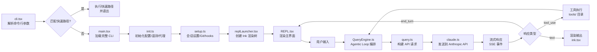

Claude Code 是一个基于 Bun + React (Ink) 构建的终端 AI 编程助手。它的源码经过 Bun 打包器编译，最终产物是一个单一的可执行文件。本文从反编译的 `src/` 目录出发，梳理项目的整体架构。

## 三个入口点

Claude Code 有三个主要的入口文件，分别服务于不同的运行模式：

### `entrypoints/cli.tsx` — 主 REPL 入口

这是最核心的入口，负责启动交互式终端界面。文件开头的注释说明了它的设计哲学：**所有 import 都是动态的**，以便在快速路径上最小化模块加载开销。

快速路径分支（按检查顺序）：

| 命令/标志 | 行为 | 备注 |
|-----------|------|------|
| `--version` / `-v` | 直接输出版本号并退出 | **零 import**，仅使用 `MACRO.VERSION` 编译时常量 |
| `--dump-system-prompt` | 输出渲染后的系统提示词并退出 | Ant 内部使用，通过 `feature('DUMP_SYSTEM_PROMPT')` 从外部构建中消除 |
| `--claude-in-chrome-mcp` | 启动 Chrome 扩展 MCP Server | 动态加载 `claudeInChrome/mcpServer.js` |
| `--chrome-native-host` | 启动 Chrome Native Messaging Host | 动态加载 `claudeInChrome/chromeNativeHost.js` |
| `--computer-use-mcp` | 启动 Computer Use MCP Server | `feature('CHICAGO_MCP')` 门控 |
| `--daemon-worker` | 启动守护进程工作线程 | `feature('DAEMON')` 门控 |
| `remote-control` / `bridge` | 启动远程控制桥接模式 | `feature('BRIDGE_MODE')` 门控 |
| `daemon` | 启动守护进程管理器 | `feature('DAEMON')` 门控 |
| `ps` / `logs` / `attach` / `kill` / `--bg` | 后台会话管理 | `feature('BG_SESSIONS')` 门控 |
| `new` / `list` / `reply` | 模板作业命令 | `feature('TEMPLATES')` 门控 |
| `environment-runner` | BYOC 环境运行器 | `feature('BYOC_ENVIRONMENT_RUNNER')` 门控 |
| `self-hosted-runner` | 自托管运行器 | `feature('SELF_HOSTED_RUNNER')` 门控 |
| `--worktree --tmux` | tmux worktree 快速切换 | 在加载完整 CLI 前执行 tmux exec |

如果以上快速路径都未命中，则进入完整 CLI 流程：

1. 调用 `startCapturingEarlyInput()` 开始捕获用户提前输入的按键
2. 动态加载 `main.tsx`（即 `cliMain`）
3. 执行完整的 REPL 启动流程

### `entrypoints/mcp.ts` — MCP Server 模式

以 MCP (Model Context Protocol) Server 形式暴露 Claude Code 的工具能力。关键特征：

- **服务名称**：`claude/tengu`（tengu 是 Claude Code 的内部代号）
- **传输方式**：stdio（标准输入/输出）
- **能力声明**：仅暴露 `tools` capability
- **工具注册**：通过 `getTools()` 获取所有可用工具，将 Zod schema 转换为 JSON Schema 暴露给 MCP 客户端
- **命令注册**：仅注册 `review` 命令（`MCP_COMMANDS`）
- **无状态设计**：使用 `getDefaultAppState()` 和 LRU 文件缓存（100 文件 / 25MB 限制）避免内存泄漏

### `entrypoints/init.ts` — 初始化入口

负责应用启动前的全局初始化工作，使用 `lodash-es/memoize` 确保只执行一次。初始化流程：

```mermaid
flowchart TD
    A[init() 被调用] --> B[enableConfigs<br/>验证并启用配置系统]
    B --> C[applySafeConfigEnvironmentVariables<br/>应用安全的环境变量]
    C --> D[applyExtraCACertsFromConfig<br/>配置 TLS CA 证书]
    D --> E[setupGracefulShutdown<br/>注册退出清理]
    E --> F[initialize1PEventLogging<br/>初始化一方事件日志]
    F --> G[populateOAuthAccountInfoIfNeeded<br/>填充 OAuth 账户信息]
    G --> H[initializeRemoteManagedSettingsLoadingPromise<br/>启动远程设置加载]
    H --> I[initializePolicyLimitsLoadingPromise<br/>启动策略限制加载]
    I --> J[configureGlobalMTLS<br/>配置 mTLS]
    J --> K[configureGlobalAgents<br/>配置代理]
    K --> L[preconnectAnthropicApi<br/>预热 API 连接]
    L --> M[initUpstreamProxy<br/>CCR 上游代理]
    M --> N[ensureScratchpadDir<br/>创建 scratchpad 目录]
```

此外，`init.ts` 还导出 `initializeTelemetryAfterTrust()` 函数，在用户信任对话框确认后才初始化遥测（OpenTelemetry），以延迟加载约 400KB 的 OTel + protobuf 模块。

## `src/` 目录地图

以下是 `src/` 下各目录的功能分组说明：

### 核心循环

| 文件 | 角色 |
|------|------|
| `QueryEngine.ts` (~46KB) | **Agentic Loop 编排器**——管理工具调用循环、重试、错误处理 |
| `query.ts` (~68KB) | API 调用 + 流式响应处理——将消息发送到 Anthropic API 并处理 SSE 流 |
| `Tool.ts` | 工具接口定义（`Tool` type）和工具查找/权限上下文 |
| `tools.ts` | 工具注册中心——根据上下文收集和过滤可用工具 |
| `commands.ts` | 命令注册中心——管理斜杠命令的注册和查找 |

### 入口与 UI

| 目录/文件 | 角色 |
|-----------|------|
| `entrypoints/` | 三个入口文件（cli.tsx, mcp.ts, init.ts）+ SDK 类型 |
| `screens/` | 三个主要界面：`REPL.tsx`（主界面）、`ResumeConversation.tsx`（恢复会话）、`Doctor.tsx`（诊断） |
| `ink/` | 自定义终端渲染引擎（基于 Ink/React） |
| `components/` | 144 个 React 组件——对话框、消息气泡、权限提示等 |
| `cli/` | CLI 子命令处理器（bg.js 后台会话, handlers/ 各子命令） |
| `outputStyles/` | 输出样式定义 |
| `keybindings/` | 键盘快捷键映射 |
| `vim/` | Vim 模式实现 |

### 工具与命令

| 目录 | 规模 | 角色 |
|------|------|------|
| `tools/` | 43 个子目录 | 每个子目录对应一个工具实现（BashTool, FileReadTool, GlobTool, WebSearchTool 等） |
| `commands/` | 101 个文件 | 斜杠命令实现（review, commit, plan, config 等） |
| `skills/` | — | Skill 系统——可由用户自定义的高级命令封装 |
| `plugins/` | — | 插件系统 |

### 服务层

| 子目录 | 角色 |
|--------|------|
| `services/api/` | API 客户端（`claude.ts` ~125KB 是核心 Anthropic API 客户端，另有 bootstrap.ts, filesApi.ts, referral.ts 等） |
| `services/mcp/` | MCP 客户端（`client.ts` ~119KB）和官方 registry |
| `services/compact/` | 对话压缩——长对话的摘要和上下文窗口管理 |
| `services/analytics/` | 分析与遥测（GrowthBook A/B 测试、一方事件日志） |
| `services/lsp/` | Language Server Protocol 集成 |
| `services/oauth/` | OAuth 认证流程 |
| `services/policyLimits/` | 组织策略限制 |
| `services/remoteManagedSettings/` | 远程托管设置同步 |
| `services/tools/` | 工具服务层 |
| `services/SessionMemory/` | 会话记忆 |
| `services/voice/` | 语音输入/输出 |
| `services/AgentSummary/` | Agent 摘要生成 |
| `services/MagicDocs/` | 魔法文档（自动文档生成） |
| `services/PromptSuggestion/` | 提示建议 |

### 状态管理

| 目录/文件 | 角色 |
|-----------|------|
| `state/` | 自定义状态管理（`store.ts` 提供 createStore 工具函数，`AppStateStore.ts` 应用全局状态） |
| `bootstrap/state.ts` | 全局可变状态——session ID、项目根目录、非交互模式标志等，在模块加载时初始化 |

### 扩展系统

| 目录 | 角色 |
|------|------|
| `bridge/` | 远程会话桥接——将本地机器作为远程开发环境暴露（28 个文件） |
| `remote/` | 远程会话管理——WebSocket 连接、SDK 消息适配 |
| `server/` | IDE 集成——直连会话管理 |

### Agent 系统

| 目录 | 角色 |
|------|------|
| `tasks/` | 任务抽象——DreamTask, LocalAgentTask, RemoteAgentTask, InProcessTeammateTask 等 |
| `utils/swarm/` | 多 Agent 协作——团队创建、权限同步、队友初始化、进程内运行器 |
| `coordinator/` | 协调器模式 |

### 其他

| 目录 | 规模 | 角色 |
|------|------|------|
| `hooks/` | 85 个文件 | React Hooks（useQuery, useTools, usePermissions 等） |
| `utils/` | 329 个文件 | 通用工具函数（最大的目录） |
| `constants/` | `prompts.ts` ~54KB | 常量定义，包含系统提示词模板 |
| `native-ts/` | — | 原生 TypeScript 工具（可能用于原生插件） |
| `vendor/` | — | 第三方代码 |
| `memdir/` | — | 内存文件系统 |
| `context.ts` | — | 系统上下文和用户上下文构建 |
| `history.ts` | — | 命令历史管理 |

## 关键文件索引

下表列出了理解 Claude Code 架构最关键的文件：

| 文件路径 | 大小 | 角色 |
|----------|------|------|
| `QueryEngine.ts` | ~46KB | 核心 Agentic Loop 编排器，管理工具调用、重试、中断 |
| `query.ts` | ~68KB | API 调用与流式响应处理，SSE 事件解析 |
| `screens/REPL.tsx` | ~895KB | 主 REPL 界面——项目最大的单文件，包含所有 UI 交互逻辑 |
| `services/api/claude.ts` | ~125KB | Anthropic API 客户端——HTTP 请求构建、认证、速率限制 |
| `services/mcp/client.ts` | ~119KB | MCP 客户端——与外部 MCP Server 的连接和工具发现 |
| `ink/ink.tsx` | ~251KB | 自定义终端渲染引擎——基于 React 的终端 UI 框架 |
| `constants/prompts.ts` | ~54KB | 系统提示词模板——Claude 的行为指令和角色定义 |
| `state/store.ts` | ~1KB | createStore 工具函数——轻量级响应式状态管理 |
| `entrypoints/cli.tsx` | ~7KB | CLI 入口——快速路径分支和完整 CLI 加载 |
| `entrypoints/init.ts` | ~11KB | 初始化——配置、遥测、代理、策略限制 |
| `entrypoints/mcp.ts` | ~8KB | MCP Server 入口——stdio 传输的工具暴露 |
| `main.tsx` | ~数百KB | Commander CLI 定义——参数解析和 REPL 启动 |
| `setup.ts` | — | 会话设置——工作目录、Git 检测、hooks 配置 |
| `replLauncher.tsx` | — | REPL 启动器——Ink 渲染树创建和 React 组件挂载 |

## `feature()` 与 DCE 模式

Claude Code 使用 Bun 打包器的 `feature()` 函数实现**编译期死代码消除（Dead Code Elimination, DCE）**。这是理解反编译代码中大量条件 require 模式的关键。

### 工作原理

```typescript
import { feature } from 'bun:bundle'

// 编译期：如果构建时未启用 INTERNAL_FLAG，整个分支会被删除
if (feature('INTERNAL_FLAG')) {
  const { internalFunction } = require('./internal-module')
  internalFunction()
}
```

Bun 打包器在编译时会评估 `feature()` 调用。如果 feature flag 为 `false`，整个条件分支（包括 `require` 调用）都会从产物中删除，从而：

1. **减小包体积**——内部工具、实验功能不会出现在外部构建中
2. **隐藏内部逻辑**——反编译无法看到被 DCE 的代码
3. **加速启动**——不加载不需要的模块

### Feature Flag 分类

从 `cli.tsx` 中可以识别出以下几类 feature flag：

**内部标志（Ant-only，不会出现在外部构建中）：**

| Flag | 用途 |
|------|------|
| `DUMP_SYSTEM_PROMPT` | 导出系统提示词（用于 prompt 敏感性评估） |
| `ABLATION_BASELINE` | L0 消融实验基线——禁用 thinking、compact、memory 等功能 |
| `CHICAGO_MCP` | Computer Use MCP Server |
| `DAEMON` | 守护进程模式 |
| `BRIDGE_MODE` | 远程控制桥接模式 |

**实验性功能：**

| Flag | 用途 |
|------|------|
| `BG_SESSIONS` | 后台会话管理（ps/logs/attach/kill） |
| `TEMPLATES` | 模板作业命令 |
| `BYOC_ENVIRONMENT_RUNNER` | BYOC 环境运行器 |
| `SELF_HOSTED_RUNNER` | 自托管运行器 |

**产品功能：**

| Flag | 用途 |
|------|------|
| `AGENT_TRIGGERS` | Agent 触发器 |
| `VOICE_MODE` | 语音模式 |
| `MONITOR_TOOL` | 监控工具 |
| `PROACTIVE` | 主动行为（如自动 compact、自动 memory） |
| `KAIROS` | 内部代号（具体功能不明） |

### 对反编译的影响

由于 DCE 的存在，反编译得到的代码中会出现大量形如以下的模式：

```typescript
// 这些 require 在运行时永远不会执行（分支已被 DCE 删除）
// 但反编译器可能保留这些代码结构
if (false) {
  const module = require('./internal-module')
}
```

这意味着我们看到的 `src/` 目录只是完整代码库的一个**子集**——所有被 feature flag 门控的内部功能都已被编译期删除。

## 数据流概览

从用户启动 Claude Code 到收到 AI 响应的完整数据流：



### 关键数据流节点说明

1. **cli.tsx → main.tsx**：动态 import 触发完整的模块加载链。`main.tsx` 使用 Commander.js 定义 CLI 参数，并在顶层执行 MDM 读取和 Keychain 预取。

2. **main.tsx → init.ts**：通过 `memoize` 确保初始化只执行一次。配置验证、代理设置、遥测初始化都在这里完成。

3. **main.tsx → setup.ts → replLauncher.tsx**：`setup.ts` 负责会话级设置（工作目录、Git 根目录检测、hooks 快照），`replLauncher.tsx` 创建 Ink `<Root>` 并挂载 `<REPL>` 组件。

4. **REPL.tsx → QueryEngine.ts**：用户提交消息后，REPL 组件调用 QueryEngine 的 agentic loop。QueryEngine 负责循环执行：发送请求 → 解析响应 → 执行工具 → 将工具结果追加到消息 → 再次发送。

5. **QueryEngine.ts → query.ts → claude.ts**：`query.ts` 封装了流式 API 调用逻辑，`claude.ts` 是底层的 HTTP 客户端，处理认证、重试和速率限制。

## 关键文件参考

本文引用的关键文件路径汇总（路径相对于 `src/`）：

| 文件 | 说明 |
|------|------|
| `entrypoints/cli.tsx` | 主 REPL 入口 |
| `entrypoints/mcp.ts` | MCP Server 入口 |
| `entrypoints/init.ts` | 初始化入口 |
| `main.tsx` | Commander CLI 定义 |
| `setup.ts` | 会话设置 |
| `replLauncher.tsx` | REPL 启动器 |
| `QueryEngine.ts` | Agentic Loop 编排器 |
| `query.ts` | API 调用与流式处理 |
| `Tool.ts` | 工具接口定义 |
| `tools.ts` | 工具注册中心 |
| `commands.ts` | 命令注册中心 |
| `screens/REPL.tsx` | 主 REPL 界面 |
| `ink/ink.tsx` | 终端渲染引擎 |
| `services/api/claude.ts` | Anthropic API 客户端 |
| `services/mcp/client.ts` | MCP 客户端 |
| `constants/prompts.ts` | 系统提示词 |
| `state/store.ts` | 状态管理工具函数 |
| `bootstrap/state.ts` | 全局可变状态 |
| `context.ts` | 上下文构建 |
