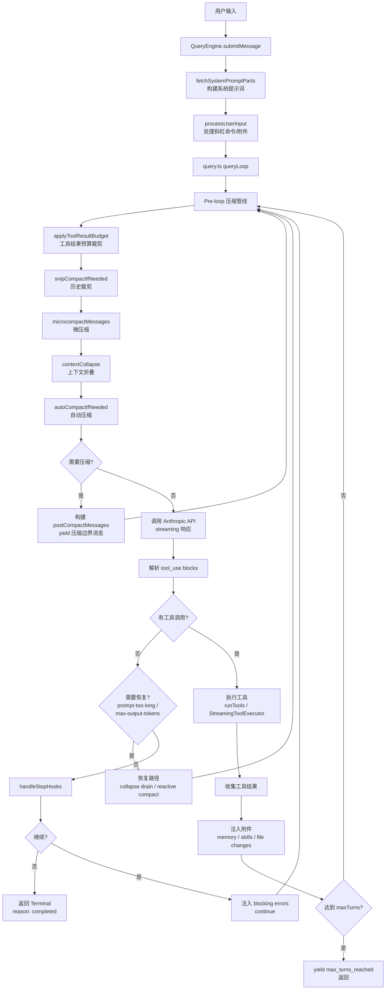
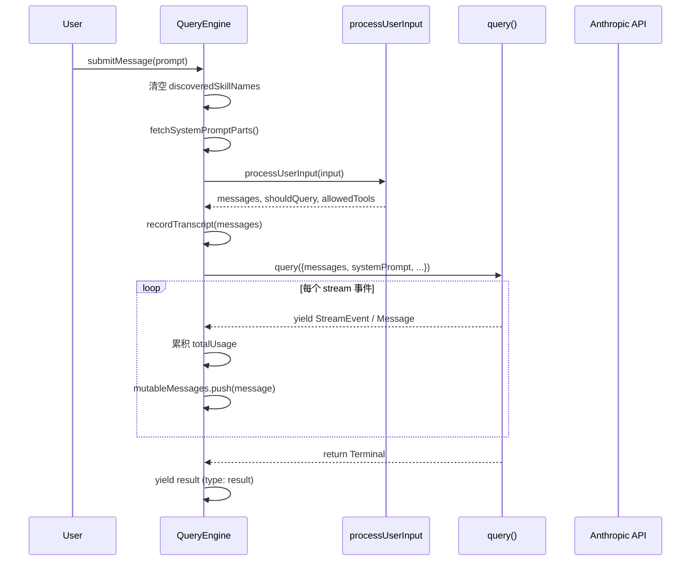
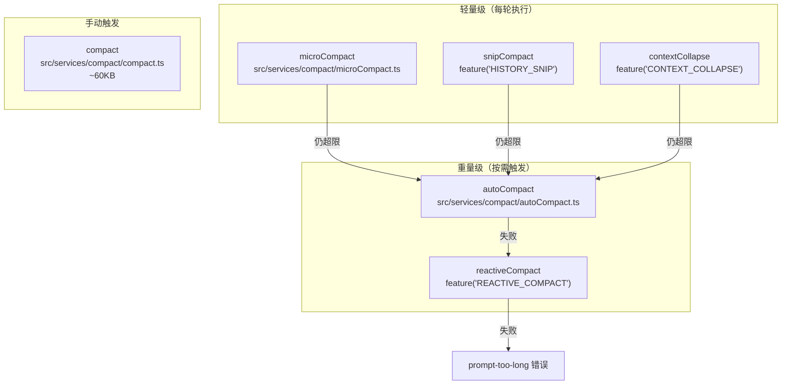

## 概述

Claude Code 的核心是一个 **agentic loop**（代理循环）：用户输入后，系统反复调用 Claude API，直到 Claude 不再请求工具调用或达到其他终止条件。这个循环由两个核心文件协作实现：

- **`QueryEngine.ts`** — 会话级编排器，管理完整的 turn 生命周期和会话状态
- **`query.ts`** — 单次 turn 内的循环引擎，负责 API 调用、工具执行、上下文压缩

下面的 Mermaid 图展示了主循环的整体流程：



## QueryEngine.ts — 会话编排器

> 源文件：`src/QueryEngine.ts`（~46KB）

`QueryEngine` 是一个 **会话级** 的编排器。每个对话会话对应一个 `QueryEngine` 实例，内部维护跨 turn 持久化的状态。

### 核心状态

```typescript
class QueryEngine {
  private mutableMessages: Message[]       // 完整对话历史
  private abortController: AbortController // 中断控制
  private permissionDenials: SDKPermissionDenial[] // 权限拒绝记录
  private totalUsage: NonNullableUsage     // 累计 token 用量
  private readFileState: FileStateCache    // 文件状态缓存
  private discoveredSkillNames: Set<string> // 已发现的 skill
}
```

关键设计点：

- **`mutableMessages`** 在整个会话期间累积，每次 `submitMessage()` 追加新消息。`query.ts` 内部从 compact boundary 之后取子集（`getMessagesAfterCompactBoundary`），因此 `mutableMessages` 保留完整历史，压缩后的消息以 `compact_boundary` 标记分界。
- **`readFileState`** 是一个 `FileStateCache`，记录已读取文件的指纹，用于跳过重复读取和内存优化。
- **`discoveredSkillNames`** 在每次 `submitMessage()` 开始时清空，跟踪当前 turn 内发现的 skill。

### submitMessage 流程

`submitMessage()` 是 `QueryEngine` 的主入口，每次用户输入触发一次：



### 系统提示词构建

`submitMessage()` 通过 `fetchSystemPromptParts()` 并行获取三部分上下文：

```typescript
const [defaultSystemPrompt, userContext, systemContext] = await Promise.all([
  getSystemPrompt(tools, mainLoopModel, ...),
  getUserContext(),
  getSystemContext(),
])
```

最终系统提示词的组装优先级（参见 `src/utils/systemPrompt.ts` 的 `buildEffectiveSystemPrompt`）：

1. **Override** 系统提示词（最高优先级，替换所有其他）
2. **Coordinator** 模式提示词
3. **Agent** 系统提示词（子代理定义）
4. **Custom** 系统提示词（`--system-prompt`）
5. **Default** 系统提示词（标准 Claude Code 提示词）

`appendSystemPrompt` 始终追加在末尾。

### 权限检查包装

`QueryEngine` 包装 `canUseTool` 函数来追踪权限拒绝：

```typescript
const wrappedCanUseTool: CanUseToolFn = async (tool, input, ...) => {
  const result = await canUseTool(tool, input, ...)
  if (result.behavior !== 'allow') {
    this.permissionDenials.push({
      tool_name: sdkCompatToolName(tool.name),
      tool_use_id: toolUseID,
      tool_input: input,
    })
  }
  return result
}
```

最终结果中会包含所有 `permission_denials`，供 SDK 调用方审计。

### 会话持久化

每轮消息写入 transcript 的时间点经过精心设计：在进入 `query()` 循环 **之前** 就写入。这样即使进程在 API 响应返回前被杀死，transcript 仍然可以从用户消息处恢复（`--resume`）。

## query.ts — 循环引擎

> 源文件：`src/query.ts`（~68KB）

`query()` 是单次 turn 内的 agentic 循环。它是一个 **async generator**，yield 出流式事件和消息，最终返回一个 `Terminal` 对象表示终止原因。

### 循环状态

```typescript
type State = {
  messages: Message[]
  toolUseContext: ToolUseContext
  autoCompactTracking: AutoCompactTrackingState | undefined
  maxOutputTokensRecoveryCount: number
  hasAttemptedReactiveCompact: boolean
  maxOutputTokensOverride: number | undefined
  pendingToolUseSummary: Promise<...> | undefined
  stopHookActive: boolean | undefined
  turnCount: number
  transition: Continue | undefined  // 上次迭代的继续原因
}
```

循环使用 `while (true)` 实现，通过 `return { reason: ... }` 终止。每次迭代开始时从 `state` 解构出所有变量，继续时通过 `state = { ...next }` 整体更新，避免遗漏字段。

### 依赖注入

`query()` 通过 `QueryDeps` 接口注入关键依赖（参见 `src/query/deps.ts`）：

```typescript
type QueryDeps = {
  callModel: typeof queryModelWithStreaming
  microcompact: typeof microcompactMessages
  autocompact: typeof autoCompactIfNeeded
  uuid: () => string
}
```

这让测试可以注入 mock 而不需要 spyOn 每个模块。

### Pre-loop 压缩管线

每次迭代（包括首轮）开始时，按顺序执行五层压缩：


1. **`applyToolResultBudget`** — 裁剪过大的工具结果，限制单条消息的聚合工具结果大小
2. **`snipCompactIfNeeded`** — 基于规则的旧消息裁剪（`feature('HISTORY_SNIP')` 门控）
3. **`microcompactMessages`** — 轻量级压缩，清除旧的工具结果内容
4. **`contextCollapse`** — 细粒度上下文折叠（`feature('CONTEXT_COLLAPSE')` 门控）
5. **`autoCompactIfNeeded`** — 当 token 接近上下文窗口限制时，用小模型生成对话摘要

自动压缩的阈值计算（`src/services/compact/autoCompact.ts`）：

```typescript
// 有效上下文窗口 = 模型窗口 - 摘要输出预留（最多 20k tokens）
// 自动压缩阈值 = 有效窗口 - 13k buffer tokens
const AUTOCOMPACT_BUFFER_TOKENS = 13_000
```

连续失败 3 次后停止重试（防止死循环浪费 API 调用）。

### API 调用

API 调用通过 `deps.callModel()`（生产环境即 `queryModelWithStreaming`）执行：

```typescript
for await (const message of deps.callModel({
  messages: prependUserContext(messagesForQuery, userContext),
  systemPrompt: fullSystemPrompt,
  thinkingConfig: toolUseContext.options.thinkingConfig,
  tools: toolUseContext.options.tools,
  signal: toolUseContext.abortController.signal,
  options: { model: currentModel, fallbackModel, ... },
})) { ... }
```

关键特性：

- **流式处理**：SSE 事件逐个 yield，实现实时输出
- **Fallback 模型**：遇到 `FallbackTriggeredError` 时自动切换到备用模型重试
- **Token 预算**：支持 `taskBudget` 参数，控制整个 agentic turn 的输出总量
- **Debug prompt 导出**：`createDumpPromptsFetch` 包装器保存请求体用于调试

### 工具执行

如果 API 响应包含 `tool_use` blocks，循环进入工具执行阶段：

```typescript
const toolUpdates = streamingToolExecutor
  ? streamingToolExecutor.getRemainingResults()
  : runTools(toolUseBlocks, assistantMessages, canUseTool, toolUseContext)
```

两种执行模式：

- **`StreamingToolExecutor`**（`feature('tengu_streaming_tool_execution2')` 门控）— 工具在流式接收过程中就开始并行执行，结果按工具接收顺序输出
- **`runTools`**（`src/services/tools/toolOrchestration.ts`）— 先分区再执行：只读工具并发执行，非只读工具串行执行

工具执行完成后，收集结果并注入附件（memory 预取、skill 发现、文件变更通知等），然后递增 `turnCount`，组装新的 `State` 继续循环。

### 终止条件

循环通过 `return { reason: ... }` 终止，可能的原因包括：

| Terminal reason | 说明 |
|----------------|------|
| `completed` | 正常完成，模型不再请求工具调用 |
| `max_turns` | 达到最大轮次限制 |
| `aborted_streaming` | 用户在流式输出阶段中断 |
| `aborted_tools` | 用户在工具执行阶段中断 |
| `blocking_limit` | 上下文超过硬性阻塞限制 |
| `prompt_too_long` | prompt 过长且压缩恢复失败 |
| `model_error` | API 调用出错 |
| `image_error` | 图片尺寸/格式错误 |
| `stop_hook_prevented` | stop hook 阻止继续 |
| `hook_stopped` | 工具 hook 阻止继续 |
| `max_output_tokens` | 输出 token 限制恢复耗尽 |

## 系统提示词构建

系统提示词由多个层级的模块协作构建：

### constants/prompts.ts

> 源文件：`src/constants/prompts.ts`（~54KB）

这是 Claude Code 最核心的文件之一——包含了发给 Claude 的完整系统提示词。通过 `getSystemPrompt()` 函数构建，内容包括：

- Claude Code 的身份定义和行为准则
- 工具使用指南（每个工具的说明和约束）
- 文件操作规则（git 安全、权限管理）
- 输出格式要求（markdown、代码块等）
- 模型特定指令

### utils/queryContext.ts

> 源文件：`src/utils/queryContext.ts`

`fetchSystemPromptParts()` 并行获取系统提示词三要素：

- **`defaultSystemPrompt`**：从 `getSystemPrompt()` 获取的完整系统提示词
- **`userContext`**：动态用户上下文（git status、CLAUDE.md 文件内容、当前日期等），注入为消息前缀
- **`systemContext`**：系统级上下文（工具配置等），追加到系统提示词末尾

### utils/systemPrompt.ts

> 源文件：`src/utils/systemPrompt.ts`

`buildEffectiveSystemPrompt()` 根据运行模式选择正确的提示词组合。支持 override、coordinator、agent、custom、default 五个优先级层。

### 上下文缓存

系统提示词的构建结果会被缓存，作为 API prompt cache 的 key 前缀。缓存命中可以显著降低成本和延迟——这也是为什么 `userContext` 和 `systemContext` 与 `systemPrompt` 分开管理：只要这三部分不变，整个前缀就是缓存友好的。

## Compact 系统 — 上下文管理

Claude Code 实现了多层次的上下文管理策略，确保长对话不会超出模型的上下文窗口。

### 三层压缩架构



### microCompact（微压缩）

> 源文件：`src/services/compact/microCompact.ts`

轻量级压缩，清除旧工具调用结果中的实际内容，替换为 `[Old tool result content cleared]` 标记。只处理特定工具的结果：

```typescript
const COMPACTABLE_TOOLS = new Set([
  'file_read', 'bash', 'grep', 'glob',
  'web_search', 'web_fetch', 'file_edit', 'file_write',
])
```

支持两种模式：
- **基于时间**（默认）：清除超过配置时间的老旧结果
- **基于缓存**（`feature('CACHED_MICROCOMPACT')`）：利用 API 的 cache deletion 能力，直接删除已缓存的旧输入

### autoCompact（自动压缩）

> 源文件：`src/services/compact/autoCompact.ts`

当 token 用量超过阈值时，使用小模型（如 Haiku）将完整对话压缩为摘要。关键参数：

```typescript
const MAX_OUTPUT_TOKENS_FOR_SUMMARY = 20_000  // 摘要输出上限
const AUTOCOMPACT_BUFFER_TOKENS = 13_000      // 触发阈值缓冲
const MAX_CONSECUTIVE_AUTOCOMPACT_FAILURES = 3 // 连续失败上限
```

压缩后会 yield 一个 `compact_boundary` 消息，标记历史消息的截断点。后续查询只使用 boundary 之后的消息。

### reactiveCompact（反应式压缩）

> 门控：`feature('REACTIVE_COMPACT')`

在 API 返回 `prompt_too_long` 错误时触发。与 autoCompact 的区别：

- autoCompact 是**主动式**的，在 API 调用前预防性压缩
- reactiveCompact 是**反应式**的，在 API 调用失败后补救性压缩

### compact（手动压缩）

> 源文件：`src/services/compact/compact.ts`（~60KB）

用户通过 `/compact` 命令手动触发。功能最完整：

- 使用 forked agent 执行压缩，不阻塞主对话
- 支持部分压缩（`partialCompact`），只压缩早期消息
- 压缩后恢复关键文件内容（`POST_COMPACT_MAX_FILES_TO_RESTORE = 5`）
- 执行 pre/post compact hooks

### Token 预算系统

相关工具文件：

- `src/utils/context.ts` — 模型上下文窗口大小定义，默认 200k tokens，支持 1M 上下文
- `src/utils/tokens.ts` — token 计数和估算
- `src/query/tokenBudget.ts` — per-turn token 预算跟踪

默认输出 token 上限采用 **slot 预留优化**（`CAPPED_DEFAULT_MAX_TOKENS = 8,000`），因为 p99 输出仅约 4,911 tokens。超过限制时自动升级到 64k 并重试。

## 工具执行管道

工具执行有两条路径（详细机制参见 [工具系统](./tool-system.md)）：

### StreamingToolExecutor

> 源文件：`src/services/tools/StreamingToolExecutor.ts`

流式工具执行器，在 API 响应流式到达时就开始执行工具。核心特性：

- 工具按接收顺序排队执行
- 并发安全的工具可以并行执行
- 结果按工具接收顺序输出（即使并行完成）
- 遇到错误时通过 `siblingAbortController` 中止兄弟进程

### toolOrchestration

> 源文件：`src/services/tools/toolOrchestration.ts`

传统工具编排器，在完整响应到达后批量执行：

- `partitionToolCalls()` 将工具调用分为并发安全和不安全两组
- 只读工具（如 `Read`、`Grep`）并发执行
- 写操作工具串行执行
- 最大并发数可通过 `CLAUDE_CODE_MAX_TOOL_USE_CONCURRENCY` 配置（默认 10）

### 工具结果处理

工具执行完成后：

1. 结果经过 `normalizeMessagesForAPI()` 规范化
2. 通过 `applyToolResultBudget()` 裁剪过大的结果
3. 附件（memory、skills、file changes）通过 `getAttachmentMessages()` 注入
4. 工具使用摘要通过 `generateToolUseSummary()` 异步生成（Haiku 模型，不阻塞下一轮）

## 关键文件参考

| 文件路径 | 大小 | 职责 |
|---------|------|------|
| `src/QueryEngine.ts` | ~46KB | 会话级编排器，管理 turn 生命周期和会话状态 |
| `src/query.ts` | ~68KB | 单 turn 内的 agentic 循环引擎 |
| `src/query/deps.ts` | ~1KB | query() 的依赖注入接口 |
| `src/query/config.ts` | ~1KB | 不可变运行时配置快照 |
| `src/query/stopHooks.ts` | - | stop hook 处理逻辑 |
| `src/query/tokenBudget.ts` | - | per-turn token 预算跟踪 |
| `src/services/api/claude.ts` | - | Anthropic API 调用、流式响应处理 |
| `src/services/compact/compact.ts` | ~60KB | 手动压缩实现 |
| `src/services/compact/autoCompact.ts` | - | 自动压缩触发与执行 |
| `src/services/compact/microCompact.ts` | - | 轻量级微压缩 |
| `src/services/tools/toolOrchestration.ts` | - | 批量工具编排执行 |
| `src/services/tools/StreamingToolExecutor.ts` | - | 流式工具执行器 |
| `src/constants/prompts.ts` | ~54KB | 系统提示词定义 |
| `src/utils/queryContext.ts` | - | 系统提示词上下文获取 |
| `src/utils/systemPrompt.ts` | - | 系统提示词组装逻辑 |
| `src/utils/context.ts` | - | 模型上下文窗口和 token 限制定义 |
| `src/utils/tokens.ts` | - | token 计数和估算工具 |
