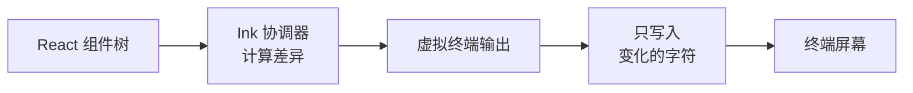

# React 与终端渲染基础

> Claude Code 的界面是用 React 渲染到终端里的。本文解释相关的前端和终端概念。

## React 基础

React 是一个用于构建用户界面的 JavaScript 库。Claude Code 选择了 React 作为界面框架——只不过它把界面渲染到了**终端**而非浏览器。

### Virtual DOM（虚拟 DOM）

React 的核心设计思想。

传统做法：数据变化 → 直接操作页面元素 → 页面更新。问题是操作 DOM 很慢，频繁更新会导致性能问题。

React 的做法：在内存中维护一份"虚拟"的页面结构（Virtual DOM）。数据变化时，先在虚拟 DOM 上计算差异（diff），只把真正变化的部分更新到实际页面。

```
数据变化
  ↓
对比新旧 Virtual DOM（找出差异）
  ↓
只更新实际页面中变化的部分
```

Claude Code 的 Ink 渲染器也采用了同样的思路——只不过最终"渲染"的目标不是浏览器 DOM，而是**终端屏幕上的字符**。

### Reconciler（协调器）

React 的核心模块，负责执行上述 diff 和更新流程。

React 官方提供了 `react-dom`（浏览器）和 `react-native`（移动端）两个协调器。Claude Code 使用的是**自定义协调器**（基于 Ink 的 fork），目标平台是终端。

### JSX

一种让你在 JavaScript 中写类 HTML 语法的语法扩展：

```jsx
// JSX 写法
<div>
  <h1>标题</h1>
  <p>内容</p>
</div>

// 编译后的实际代码
React.createElement('div', null,
  React.createElement('h1', null, '标题'),
  React.createElement('p', null, '内容')
)
```

在 Claude Code 的源码中，`.tsx` 文件就是包含 JSX 语法的 TypeScript 文件。

### Hooks

React 中让函数组件拥有"状态"和"副作用"能力的机制。

```jsx
function Counter() {
  const [count, setCount] = useState(0)     // 状态 Hook
  useEffect(() => { console.log(count) }, [count])  // 副作用 Hook
  return <Text>计数: {count}</Text>
}
```

Claude Code 有 **85+ 个自定义 Hooks**，比如：
- `useTypeahead` — 自动补全
- `useVirtualScroll` — 虚拟滚动（只渲染可见区域的消息）
- `useCanUseTool` — 工具权限检查

### React Context

React 的"依赖注入"机制，用于在组件树中共享数据，避免逐层传递属性（即避免 **prop drilling**）。

```jsx
// 在顶层提供数据
<AppStateProvider value={appState}>
  <REPL />  {/* 所有子组件都能访问 appState */}
</AppStateProvider>

// 在任意深度的子组件中消费数据
function SomeDeepComponent() {
  const state = useContext(AppStateContext)
}
```

Claude Code 使用 Context 传递全局状态（应用状态、消息列表、通知等）。

## Ink — 终端界的 React

[Ink](https://github.com/vadimdemedes/ink) 是一个开源库，让你可以用 React 的方式构建终端应用。

### 工作原理



Ink 把 React 的组件模型映射到终端：
- `<div>` → 一个矩形区域
- `<Text>` → 一行文本
- `<Box>` → 一个容器（支持 Flexbox 布局）
- 颜色、粗体、斜体 → 终端转义序列

### 为什么 Claude Code 要 Fork Ink

Claude Code 使用的是 Ink 的**深度定制版本**（`ink.tsx` 有 251KB），做了大量修改：
- 性能优化（内存池、字符串驻留、帧缓冲）
- 终端能力扩展（鼠标追踪、文本选择、剪贴板）
- 特殊协议支持（Kitty 键盘协议）
- 为 Claude Code 的大量消息和工具输出做了专门优化

## 终端渲染概念

### 终端转义序列

终端通过特殊的字符序列来控制显示效果（颜色、光标移动、清屏等）。这些序列以 `ESC`（ASCII 27）开头，所以叫"转义序列"。

常见的几种：

| 名称 | 用途 | 示例 |
|------|------|------|
| **CSI** | 光标移动、颜色、样式 | `\033[31m` = 红色文字 |
| **OSC** | 窗口标题、剪贴板、超链接 | `\033]0;标题\007` = 设置标题 |
| **DEC** | 备用屏幕、鼠标追踪 | `\033[?1049h` = 进入备用屏幕 |

### Alternate Screen（备用屏幕缓冲区）

终端的一个功能：可以切换到一块独立的"画布"，在上面绘制内容，退出时恢复原来的屏幕内容。

你在终端运行 `vim` 或 `htop` 时看到的就是备用屏幕——退出后之前的命令历史还在。Claude Code 也使用了备用屏幕，这样退出后不会污染你的终端。

### Kitty Keyboard Protocol

普通终端键盘事件有局限性——无法区分很多按键组合。Kitty 终端提出了一种增强协议，能精确传递按键信息（包括修饰键组合、特殊按键等）。

Claude Code 支持此协议以实现更好的键盘交互（比如 Vim 模式需要精确的按键识别）。

## Flexbox 与 Yoga

### Flexbox

一种布局模型，让你用简洁的方式排列元素（类似 CSS 的 flex 布局）：

```
┌─────────────────────────────────┐
│  [A]  [B]  [C]    ← 水平排列    │
│         row direction           │
├─────────────────────────────────┤
│  [D]                            │
│  [E]              ← 垂直排列    │
│  [F]          column direction  │
└─────────────────────────────────┘
```

核心概念：`flexDirection`（排列方向）、`justifyContent`（主轴对齐）、`alignItems`（交叉轴对齐）、`gap`（间距）。

### Yoga

Facebook 开源的 Flexbox 布局引擎，用 C/C++ 实现。被 React Native、Sketch 等项目使用。

Claude Code 使用 Yoga 来计算终端 UI 的布局——虽然终端没有像素，但可以用字符的行列来模拟类似的效果。

## 下一节

- [协议与基础设施](./protocols-infra) — 理解 MCP、OAuth 等协议概念
- [项目架构总览](./architecture-overview) — 开始深入 Claude Code 的源码结构
