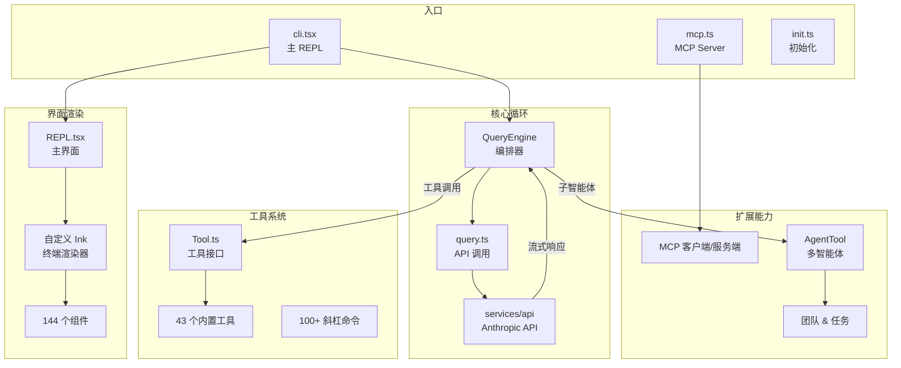

# Claude Code 源码分析

> 基于 Claude Code 构建产物的源码分析，从架构层面理解其设计与实现。

## 关于这份分析

### 数据来源

本系列基于 Claude Code 的 **构建产物**（decompiled build artifact）进行分析，而非 Anthropic 的原始源码仓库。

这意味着：

- 变量名可能与原始源码不完全一致
- 部分代码经过 minification 处理
- 存在 DCE（Dead Code Elimination）留下的条件导入痕迹
- 但整体架构和模块关系是准确的

### 技术栈

| 维度 | 技术 |
|------|------|
| 运行时 | Bun |
| 语言 | TypeScript |
| UI 框架 | React + 自定义 Ink 终端渲染器 |
| API | Anthropic Messages API（streaming） |
| 协议 | MCP（Model Context Protocol） |
| 规模 | ~1,884 个 TypeScript 文件 |

### 架构总览

## 学习路径

::: tip 新手建议
如果你对 REPL、Token、MCP 等术语不熟悉，建议先阅读「前置知识」部分。
:::

### 前置知识

1. [核心概念](./prerequisites) — REPL、Streaming、Tokens、System Prompt、Agentic Loop 等
2. [React 与终端渲染基础](./frontend-basics) — Virtual DOM、Ink、终端转义序列等
3. [协议与基础设施](./protocols-infra) — MCP、OAuth、WebSocket、LSP、Feature Flags 等

### 概览

1. [项目架构总览](./architecture-overview) — 入口点、目录结构、技术栈全景

### 核心循环

1. [核心查询循环](./core-query-loop) — QueryEngine、流式调用、上下文管理
2. [工具系统](./tool-system) — 工具接口、权限、内置工具、命令系统

### 界面渲染

1. [终端渲染系统](./terminal-rendering) — 自定义 Ink、REPL 屏幕、组件架构

### 扩展能力

1. [MCP 集成](./mcp-integration) — MCP 客户端/服务端、连接管理
2. [多智能体系统](./multi-agent-system) — AgentTool、团队协作、Swarm

### 基础设施

1. [状态管理与基础设施](./state-management) — 状态、配置、认证、插件
2. [构建系统与代码消除](./build-system) — Feature flags、DCE、原生模块
