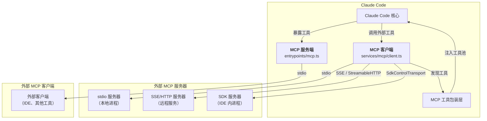

## MCP 架构概览

Claude Code 实现了 **双向 MCP 支持**：既作为 MCP 客户端连接外部 MCP 服务器，也作为 MCP 服务器暴露自身工具给其他客户端。这种设计使其既能扩展能力（通过外部工具），又能被其他系统集成（作为工具提供方）。



整个 MCP 模块位于 `services/mcp/` 目录，包含 20 个文件，涵盖连接管理、配置解析、OAuth 认证、传输层适配等完整功能。

## MCP 客户端

MCP 客户端的核心实现位于 `services/mcp/client.ts`（约 119KB），是整个 MCP 集成中最复杂的模块。

### 传输层适配

Claude Code 支持多种 MCP 传输协议，根据服务器配置自动选择：

| 传输类型 | 适用场景 | SDK Transport 类 |
|---------|---------|-----------------|
| `stdio` | 本地进程（默认） | `StdioClientTransport` |
| `sse` | Server-Sent Events | `SSEClientTransport` |
| `http` | Streamable HTTP | `StreamableHTTPClientTransport` |
| `ws` | WebSocket | `WebSocketTransport` |
| `sse-ide` / `ws-ide` | IDE 扩展内部 | `SSEClientTransport` / 自定义 |
| `sdk` | SDK 进程内 | `SdkControlClientTransport` |
| `claudeai-proxy` | Claude.ai 代理 | `StreamableHTTPClientTransport` |

对于 `stdio` 类型（最常见），传输层创建子进程并通过标准输入/输出进行 JSON-RPC 通信。连接时会将 `subprocessEnv()` 环境变量与服务器配置的 `env` 合并，并将 stderr 设为 `pipe` 模式以避免错误输出污染 UI。

对于特殊服务器（如 Chrome MCP、Computer Use MCP），采用 `InProcessTransport` 在同一进程内运行，避免启动额外子进程（Chrome 子进程约 325MB）。

### 服务器连接与生命周期

连接流程由 `connectToServer` 函数管理，主要步骤：

1. **传输层创建** — 根据配置类型实例化对应的 Transport
2. **客户端实例化** — 创建 `Client` 对象，声明 `roots` 和 `elicitation` 能力
3. **能力协商** — `client.connect(transport)` 完成 MCP 握手
4. **超时控制** — 通过 `Promise.race` 实现连接超时
5. **错误处理** — 区分连接失败、认证失败、超时等不同场景

连接状态通过联合类型 `MCPServerConnection` 表示，包含五种状态：

```typescript
type MCPServerConnection =
  | ConnectedMCPServer   // 已连接
  | FailedMCPServer      // 连接失败
  | NeedsAuthMCPServer   // 需要认证
  | PendingMCPServer     // 等待重连
  | DisabledMCPServer    // 已禁用
```

`ensureConnectedClient` 函数用于在工具调用前确保连接有效，对于过期会话会触发重新连接。

### 工具发现与包装

`fetchToolsForClient` 函数负责从已连接的 MCP 服务器发现工具并将其转换为 Claude Code 原生 `Tool` 接口：

```typescript
// 从 MCP 服务器获取工具列表
const result = await client.client.request(
  { method: 'tools/list' },
  ListToolsResultSchema,
)

// 将 MCP 工具转换为原生 Tool 格式
return toolsToProcess.map((tool): Tool => {
  const fullyQualifiedName = buildMcpToolName(client.name, tool.name)
  return {
    ...MCPTool,
    name: fullyQualifiedName,          // 格式: mcp__<服务器名>__<工具名>
    mcpInfo: { serverName, toolName }, // 保留原始映射
    isMcp: true,
    // ...
  }
})
```

工具命名遵循 `mcp__<服务器名>__<工具名>` 的约定（通过 `buildMcpToolName` 函数构建），确保来自不同服务器的同名工具不会冲突。SDK MCP 服务器支持跳过 `mcp__` 前缀模式（`CLAUDE_AGENT_SDK_MCP_NO_PREFIX` 环境变量），允许 MCP 工具覆盖内置工具。

### 资源处理

如果 MCP 服务器声明了 `resources` 能力，`fetchResourcesForClient` 会获取资源列表。资源数据以 `ServerResource` 类型存储（在原始 `Resource` 基础上附加 `server` 字段标识来源）。

### 批量连接与并发控制

`getMcpToolsCommandsAndResources` 是启动时批量连接所有 MCP 服务器的入口函数，它将服务器分为本地（stdio/sdk）和远程两组，分别使用不同的并发度：

- 本地服务器：较低的并发度（避免进程创建资源竞争）
- 远程服务器：较高的并发度（仅网络连接）

每个服务器连接成功后，通过回调函数 `onConnectionAttempt` 逐步将工具注入工具池。

## MCP 服务端

Claude Code 自身也可以作为 MCP 服务器运行，入口在 `entrypoints/mcp.ts`。

### 服务器注册

```typescript
const server = new Server(
  {
    name: 'claude/tengu',  // 服务器标识
    version: MACRO.VERSION,
  },
  {
    capabilities: {
      tools: {},  // 声明工具能力
    },
  },
)
```

服务器名为 `claude/tengu`（tengu 是 Claude Code 的内部代号），通过 `StdioServerTransport` 暴露，使用标准输入/输出进行 JSON-RPC 通信。

### ListTools 处理

当外部客户端请求工具列表时，`ListToolsRequestSchema` 处理器会：

1. 调用 `getTools()` 获取所有内置工具
2. 对每个工具生成描述（`tool.prompt()`）
3. 将 Zod schema 转换为 JSON Schema（通过 `zodToJsonSchema`）
4. 处理 `outputSchema`，跳过包含 `anyOf/oneOf` 的 schema

### CallTool 处理

`CallToolRequestSchema` 处理器接收工具调用请求：

1. 通过 `findToolByName` 查找目标工具
2. 构建简化的 `ToolUseContext`（MCP 服务器场景下 `mcpClients` 为空，thinking 配置为 `disabled`）
3. 验证输入并执行工具调用
4. 将结果包装为 MCP 标准格式返回

MCP 服务端模式下不暴露外部 MCP 工具（代码注释标注为 TODO），权限系统通过 `hasPermissionsToUseTool` 函数检查。

## MCP 工具包装

外部 MCP 工具需要适配为 Claude Code 的原生 `Tool` 接口才能注入工具池。参见 [工具系统](./tool-system) 了解工具接口的完整定义。

### MCPTool

`tools/MCPTool/MCPTool.ts` 定义了 MCP 工具的基础模板：

```typescript
export const MCPTool = buildTool({
  isMcp: true,
  name: 'mcp',           // 运行时被覆盖为 mcp__<服务器>__<工具>
  maxResultSizeChars: 100_000,
  inputSchema: z.object({}).passthrough(),  // 接受任意输入
  outputSchema: z.string(),
  checkPermissions() {
    return { behavior: 'passthrough', message: 'MCPTool requires permission.' }
  },
  // ...UI 渲染函数
})
```

`MCPTool` 本身是一个模板对象。`client.ts` 中的 `fetchToolsForClient` 在实际创建工具时，通过展开运算符复制 `MCPTool` 的所有属性，然后覆盖 `name`、`call`、`description`、`inputSchema` 等字段，将外部工具的 schema 和调用逻辑桥接到原生接口。

### ListMcpResourcesTool 与 ReadMcpResourceTool

当任何 MCP 服务器声明了 `resources` 能力时，这两个内置工具会被添加到工具池：

- `ListMcpResourcesTool` — 列出所有已连接 MCP 服务器提供的资源
- `ReadMcpResourceTool` — 读取指定 MCP 资源的内容

它们在 `tools.ts` 中作为常量工具注册，并通过 `getMcpToolsCommandsAndResources` 在首次遇到支持资源的 MCP 服务器时注入。

### McpAuthTool

对于需要 OAuth 认证但尚未授权的 MCP 服务器，`createMcpAuthTool` 动态创建一个认证工具。该工具在服务器状态为 `needs-auth` 时替代原始工具添加到工具池，引导用户完成 OAuth 授权流程。

### 动态工具注入

工具池的构建是渐进式的。`prefetchAllMcpResources` 函数在启动时通过回调逐步累积工具：

```typescript
getMcpToolsCommandsAndResources(result => {
  clients.push(result.client)
  tools.push(...result.tools)     // 逐步注入 MCP 工具
  commands.push(...result.commands)
  completedCount++
  // ...
})
```

每个 MCP 服务器连接成功后，其工具、命令、资源立即被加入对应数组，实现了工具池的动态扩展。

## MCP 配置与认证

### 配置加载

`services/mcp/config.ts` 负责从多个来源加载 MCP 服务器配置：

- **全局配置** — `~/.claude/settings.json` 中的 `mcpServers`
- **项目配置** — `.claude/settings.json`（项目级）
- **动态配置** — `.mcp.json`（运行时管理）
- **企业配置** — 托管路径下的 `managed-mcp.json`
- **Claude.ai 配置** — 通过 `fetchClaudeAIMcpConfigsIfEligible` 获取
- **插件配置** — 通过 `getPluginMcpServers` 获取

每个配置项会附加 `scope` 字段标识来源，最终合并为统一的 `Record<string, ScopedMcpServerConfig>` 结构。

`getAllMcpConfigs` 函数按优先级合并所有来源的配置，同名服务器按 local > user > project > dynamic > enterprise > claudeai > managed 的顺序覆盖。

### 服务器配置类型

配置支持多种传输类型（定义在 `services/mcp/types.ts`）：

| 类型 | 关键字段 | 说明 |
|-----|---------|------|
| `stdio` | `command`, `args`, `env` | 本地进程（默认类型） |
| `sse` | `url`, `headers`, `oauth` | SSE 远程连接 |
| `http` | `url`, `headers`, `oauth` | Streamable HTTP |
| `ws` | `url`, `headers` | WebSocket |
| `sdk` | `name` | SDK 进程内通信 |
| `sse-ide` | `url`, `ideName` | IDE 扩展（内部） |
| `claudeai-proxy` | `url`, `id` | Claude.ai 代理 |

`env` 字段中的环境变量支持通过 `expandEnvVarsInString` 进行变量展开。

### OAuth 认证

`services/mcp/auth.ts`（约 88KB）实现了完整的 MCP OAuth 2.0 认证流程，基于 `@modelcontextprotocol/sdk` 的 `auth` 模块构建：

- **授权服务器发现** — 通过 `authServerMetadataUrl` 或 OAuth Discovery 自动发现
- **授权码流程** — 启动本地 HTTP 服务器接收回调，打开浏览器引导用户授权
- **令牌管理** — 令牌存储在系统安全存储中（macOS Keychain 等），通过 `SecureStorage` 抽象层访问
- **令牌刷新** — 自动检测过期并刷新，`AUTH_REQUEST_TIMEOUT_MS` 控制单次请求超时（30 秒）
- **XAA（跨应用访问）** — 通过 SEP-990 规范实现跨应用令牌交换，使用 IdP 身份令牌进行授权

认证流程中还集成了 Claude 自身的 OAuth 令牌管理（`checkAndRefreshOAuthTokenIfNeeded`），用于需要代表用户访问 Claude.ai 代理的场景。

## MCP 与 Agent 系统

子 Agent 通过 [多智能体系统](./multi-agent-system) 中描述的 `AgentTool` 创建。在子 Agent 的执行过程中，MCP 工具通过以下方式参与：

1. **工具池继承** — 子 Agent 通过 `toolUseContext.options.tools` 获取工具池，该池已包含所有已连接的 MCP 工具
2. **系统提示集成** — `getSystemPrompt` 函数接收 `mcpClients` 参数，将 MCP 工具信息写入子 Agent 的系统提示
3. **MCP 就绪检查** — `AgentTool` 在执行前检查是否有 `pending` 或 `failed` 状态的 MCP 服务器，对于 `requiredMcpServers` 中指定的服务器会等待连接完成
4. **SDK MCP 客户端** — `setupSdkMcpClients` 函数为 Agent SDK 场景建立特殊的 MCP 连接，使用 `SdkControlClientTransport` 通过控制消息桥接 SDK 进程与 CLI 进程

### InProcessTransport

`services/mcp/InProcessTransport.ts` 实现了进程内双向通信通道，用于在 Claude Code 进程内部运行 MCP 服务器：

```typescript
export function createLinkedTransportPair(): [Transport, Transport] {
  const a = new InProcessTransport()
  const b = new InProcessTransport()
  a._setPeer(b)
  b._setPeer(a)
  return [a, b]
}
```

这对传输对象使 MCP 客户端和服务端在同一进程内通过 `queueMicrotask` 异步交付消息，避免了栈深度问题。目前用于 Chrome MCP 和 Computer Use MCP 服务器。

### SdkControlTransport

`services/mcp/SdkControlTransport.ts` 实现了更复杂的跨进程通信桥接，用于 IDE 扩展场景：

- `SdkControlClientTransport`（CLI 侧）— 将 MCP 消息包装为控制请求发送给 SDK 进程
- `SdkControlServerTransport`（SDK 侧）— 接收控制请求并路由到对应的 MCP 服务器

支持多个 SDK MCP 服务器同时运行，通过 `server_name` 字段路由消息。

## 关键文件参考

| 文件路径 | 说明 |
|---------|------|
| `services/mcp/client.ts` | MCP 客户端核心：连接管理、工具发现、资源获取 |
| `services/mcp/config.ts` | MCP 服务器配置加载与合并 |
| `services/mcp/types.ts` | 所有 MCP 相关类型定义（配置 schema、连接状态等） |
| `services/mcp/auth.ts` | OAuth 2.0 认证流程实现 |
| `services/mcp/MCPConnectionManager.tsx` | React Context：提供重连和开关 MCP 服务器的 UI 方法 |
| `services/mcp/InProcessTransport.ts` | 进程内 MCP 传输通道 |
| `services/mcp/SdkControlTransport.ts` | SDK 跨进程 MCP 传输桥接 |
| `services/mcp/useManageMCPConnections.ts` | MCP 连接管理的 React Hook |
| `services/mcp/claudeai.ts` | Claude.ai 代理 MCP 配置获取 |
| `services/mcp/elicitationHandler.ts` | MCP Elicitation（请求确认）处理 |
| `services/mcp/normalization.ts` | MCP 工具名称规范化 |
| `services/mcp/mcpStringUtils.ts` | MCP 工具名称构建（`mcp__` 前缀） |
| `services/mcp/headersHelper.ts` | MCP 请求头辅助函数 |
| `services/mcp/envExpansion.ts` | 环境变量展开 |
| `entrypoints/mcp.ts` | MCP 服务端入口（`claude/tengu`） |
| `tools/MCPTool/MCPTool.ts` | MCP 工具包装模板 |
| `tools/ListMcpResourcesTool/` | 列出 MCP 资源的内置工具 |
| `tools/ReadMcpResourceTool/` | 读取 MCP 资源的内置工具 |
| `tools/McpAuthTool/` | MCP 服务器认证工具 |
