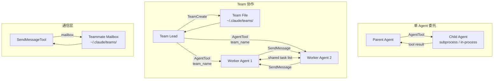
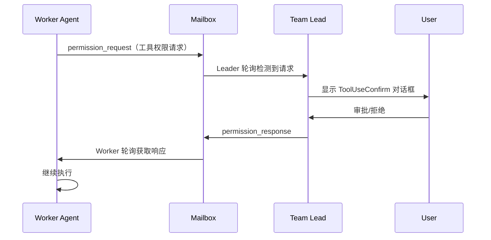

## 概述

Claude Code 支持多智能体协作，允许一个主 agent（parent）生成子 agent 来并行处理子任务，或通过 Team 系统组建多个 agent 协同工作。这套机制是 Claude Code 实现"分而治之"任务编排的基础。

整个多智能体架构包含三个层次：



核心入口是 `tools/AgentTool/AgentTool.tsx`，它是 Agent 工具的实现，负责创建和运行子智能体。

## AgentTool — 子智能体

### 核心机制

`AgentTool` 是一个普通工具，但它的执行逻辑是创建并运行另一个完整的 agent 实例。输入 schema 定义在 `AgentTool.tsx` 中：

```typescript
// 基础参数
{
  description: string   // 3-5 词的任务描述
  prompt: string        // 任务指令
  subagent_type?: string // 专用 agent 类型
  model?: 'sonnet' | 'opus' | 'haiku' // 模型覆盖
  run_in_background?: boolean // 后台运行
}

// 多 agent 参数
{
  name?: string          // 可寻址名称，用于 SendMessage
  team_name?: string     // 所属团队
  mode?: PermissionMode  // 权限模式（如 "plan"）
  isolation?: 'worktree' // 隔离模式
  cwd?: string           // 工作目录覆盖
}
```

### Agent 生命周期

子 agent 的完整生命周期如下：


1. **创建** — 解析 `subagent_type`，查找对应的 agent 定义（内置或自定义）
2. **上下文设置** — 构建独立的系统提示词、消息历史、工具池（`runAgent.ts` 中的 `createSubagentContext`）
3. **工具分配** — 根据 agent 定义的 `tools` / `disallowedTools` 过滤工具池（`agentToolUtils.ts` 中的 `filterToolsForAgent`）
4. **查询循环** — 进入独立的 [核心查询循环](./core-query-loop)，调用 `query.ts` 的 `queryLoop`
5. **结果返回** — 循环结束后，提取文本结果返回给父 agent

### 隔离机制

每个子 agent 拥有独立的：

- **Context** — 通过 `AsyncLocalStorage` 实现上下文隔离（`utils/agentContext.ts`）
- **工具池** — 根据 agent 定义的 `tools` 白名单或 `disallowedTools` 黑名单过滤
- **系统提示词** — agent 定义可以自定义 `getSystemPrompt()`，也可覆盖（override）父级的提示词
- **工作目录** — 通过 `cwd` 参数或 worktree 隔离

#### Worktree 隔离

当 `isolation: "worktree"` 时，系统会创建一个临时 git worktree（`utils/worktree.ts`），agent 在隔离的 repo 副本中工作。完成后通过 `hasWorktreeChanges()` 检查变更，`removeAgentWorktree()` 清理。

#### Fork Subagent

`forkSubagent.ts` 实现了一种特殊的子 agent 模式——fork 子 agent。启用时（`isForkSubagentEnabled()`），省略 `subagent_type` 会触发隐式 fork：

- 子 agent 继承父级的完整对话上下文和系统提示词
- 所有 agent spawn 在后台运行（async），统一使用 `<task-notification>` 交互模型
- 通过检测 `FORK_BOILERPLATE_TAG` 防止递归 fork

### 内置 Agent 类型

`builtInAgents.ts` 中的 `getBuiltInAgents()` 返回可用的内置 agent：

| 类型 | 文件 | 说明 |
|------|------|------|
| `GeneralPurpose` | `built-in/generalPurposeAgent.ts` | 通用 agent，完整的工具集 |
| `Explore` | `built-in/exploreAgent.ts` | 只读探索，只读工具集（`ONE_SHOT_BUILTIN_AGENT_TYPES` 之一） |
| `Plan` | `built-in/planAgent.ts` | 规划 agent，需要 plan approval（`ONE_SHOT_BUILTIN_AGENT_TYPES` 之一） |
| `ClaudeCodeGuide` | `built-in/claudeCodeGuideAgent.ts` | 代码指南，非 SDK 入口点可见 |
| `Verification` | `built-in/verificationAgent.ts` | 验证 agent，受 feature gate 控制 |
| `StatuslineSetup` | `built-in/statuslineSetup.ts` | 状态栏设置 agent |

其中 `Explore` 和 `Plan` 是 **one-shot** 类型（定义在 `constants.ts` 的 `ONE_SHOT_BUILTIN_AGENT_TYPES`），父 agent 不会向它们发送 `SendMessage`，节省 token。

Explore 和 Plan 的启用受 `BUILTIN_EXPLORE_PLAN_AGENTS` feature gate 和 GrowthBook A/B 测试（`tengu_amber_stoat`）控制。

### 自定义 Agent

除了内置 agent，Claude Code 支持从 `.claude/agents/` 目录加载自定义 agent 定义（`loadAgentsDir.ts`）。自定义 agent 通过 Markdown frontmatter 配置：

```yaml
---
model: sonnet
tools:
  - Read
  - Glob
  - Grep
allowed-tools:
  - Agent[Explore]
---
```

自定义 agent 的 MCP 服务器需求通过 `hasRequiredMcpServers()` 检查，只有 MCP 服务器就绪时才启用对应的 agent（`filterAgentsByMcpRequirements`）。

## Team 系统

Team 系统是多 agent 协作的高级模式，由 `isAgentSwarmsEnabled()` 控制。

### TeamCreateTool

`tools/TeamCreateTool/TeamCreateTool.ts` 负责创建团队：

```typescript
inputSchema: {
  team_name: string      // 团队名称
  description?: string   // 团队描述
  agent_type?: string    // 团队领导角色
}
```

创建流程：
1. 调用 `generateUniqueTeamName()` 确保名称唯一（已存在则生成 word slug）
2. 通过 `utils/swarm/teamHelpers.ts` 写入团队配置文件
3. 调用 `ensureTasksDir()` 和 `resetTaskList()` 初始化共享任务列表
4. 调用 `setLeaderTeamName()` 将 leader 的任务列表绑定到团队名

输出包含 `team_name`、`team_file_path`、`lead_agent_id`。

### TeamDeleteTool

`tools/TeamDeleteTool/TeamDeleteTool.ts` 负责清理团队资源，删除团队文件和任务目录。

### 团队文件

团队配置文件位于 `~/.claude/teams/{team-name}/config.json`，`TeamFile` 类型定义（`teamHelpers.ts`）：

```typescript
type TeamFile = {
  name: string
  description?: string
  createdAt: number
  leadAgentId: string
  leadSessionId?: string
  hiddenPaneIds?: string[]
  teamAllowedPaths?: TeamAllowedPath[] // 所有成员可编辑的路径
  members: Array<{
    agentId: string
    name: string
    agentType?: string
    model?: string
    prompt?: string
    color?: string
    planModeRequired?: boolean
    joinedAt: number
  }>
}
```

`teamAllowedPaths` 允许团队管理者预授权所有成员编辑特定路径，无需逐一审批。

### 共享任务列表

任务列表存储在 `~/.claude/tasks/{team-name}/` 目录下，所有团队成员共享同一个任务列表。通过 `utils/tasks.ts` 中的 `getTaskListId()` 解析任务列表路径——leader 通过 `setLeaderTeamName()` 绑定到团队名，确保与 tmux/iTerm2 teammates 使用相同的路径。

## Task 系统

Task 系统为 agent 提供结构化的任务管理能力，是 Team 系统中 agent 间协调的核心。

### Task 工具集

| 工具 | 文件 | 功能 |
|------|------|------|
| TaskCreate | `tools/TaskCreateTool/` | 创建任务，设置 subject、description、activeForm、metadata |
| TaskUpdate | `tools/TaskUpdateTool/` | 更新任务状态、owner、依赖关系 |
| TaskList | `tools/TaskListTool/` | 列出任务列表 |
| TaskGet | `tools/TaskGetTool/` | 获取单个任务详情 |
| TaskOutput | `tools/TaskOutputTool/` | 获取任务输出内容 |
| TaskStop | `tools/TaskStopTool/` | 停止正在运行的任务 |

Task 工具的启用由 `isTodoV2Enabled()` 控制，在非交互模式下可通过 `CLAUDE_CODE_ENABLE_TASKS` 强制启用。

### 任务模型

```typescript
type Task = {
  id: string
  subject: string
  description: string
  activeForm?: string   // 进行时形式，显示在 spinner 中
  owner?: string        // agent ID
  status: 'pending' | 'in_progress' | 'completed'
  blocks: string[]      // 此任务阻塞的任务 ID
  blockedBy: string[]   // 阻塞此任务的任务 ID
  metadata?: Record<string, unknown>
}
```

### 任务依赖

`TaskUpdateTool` 支持通过 `addBlocks` 和 `addBlockedBy` 参数建立任务间的依赖关系，实现有向无环图（DAG）式的任务编排。

### Task 类型

`src/tasks/types.ts` 定义了所有任务类型的联合类型 `TaskState`：

| 类型 | 说明 |
|------|------|
| `LocalAgentTask` | 本地 agent 任务（`tasks/LocalAgentTask/`），最常用的子 agent 任务类型 |
| `InProcessTeammateTask` | 进程内队友任务（`tasks/InProcessTeammateTask/`），通过 AsyncLocalStorage 隔离 |
| `LocalShellTask` | 本地 Shell 任务（`tasks/LocalShellTask/`），纯命令执行 |
| `RemoteAgentTask` | 远程 agent 任务（`tasks/RemoteAgentTask/`），在远程 CCR 环境运行 |
| `LocalMainSessionTask` | 主会话任务（`tasks/LocalMainSessionTask.ts`） |
| `DreamTask` | 后台异步任务（`tasks/DreamTask/`） |
| `LocalWorkflowTask` | 工作流任务（`tasks/LocalWorkflowTask/`） |
| `MonitorMcpTask` | MCP 监控任务（`tasks/MonitorMcpTask/`） |

`isBackgroundTask()` 判断任务是否应显示在后台任务指示器中——仅 `running` 或 `pending` 状态且已显式后台化的任务。

### InProcessTeammateTask

进程内队友是一种轻量级的 agent 运行方式（`utils/swarm/spawnInProcess.ts`），与基于进程的 tmux/iTerm2 teammates 不同：

- 使用 `AsyncLocalStorage` 的 `TeammateContext` 实现上下文隔离
- 创建链接的 `AbortController` 用于取消
- 在 `AppState` 中注册 `InProcessTeammateTaskState`
- 实际执行循环由 `InProcessTeammateTask` 组件处理

## 通信机制

### SendMessageTool

`tools/SendMessageTool/SendMessageTool.ts` 是 agent 间通信的核心工具，输入 schema：

```typescript
{
  to: string           // 收件人：队友名称、"*"（广播）、或特殊地址
  summary?: string     // 5-10 词的预览摘要
  message: string      // 消息内容
  structured?: object  // 结构化消息（shutdown_request/plan_approval_response 等）
}
```

支持的结构化消息类型（`StructuredMessage`）：

| type | 说明 |
|------|------|
| `shutdown_request` | 请求关闭队友 |
| `shutdown_response` | 响应关闭请求（approve/reject） |
| `plan_approval_response` | 响应 plan 审批请求 |

### 队友系统提示词补充

`utils/swarm/teammatePromptAddendum.ts` 中的 `TEAMMATE_SYSTEM_PROMPT_ADDENDUM` 被追加到队友的系统提示词中，明确告知 agent：

- 必须使用 `SendMessage` 工具与团队成员通信
- 仅写文本响应对其他队友不可见
- 用户主要通过 team lead 交互

### 消息路由与邮箱

消息通过 `utils/teammateMailbox.ts` 的 `writeToMailbox()` 投递到文件系统邮箱。对于 `LocalAgentTask`，使用 `queuePendingMessage()` 排队待处理消息。`parseAddress()` 解析收件人地址格式。

### Idle 状态与唤醒

后台运行的 agent 任务完成后，通过 `enqueueAgentNotification()` 通知父 agent。父 agent 可通过 `resumeAgentBackground()`（`resumeAgent.ts`）恢复已完成的子 agent 获取结果。

## Swarm 协调

`utils/swarm/` 目录实现了 agent 群体的高级协调功能。

### 权限同步

`permissionSync.ts` 实现了跨 agent 的权限提示协调：



权限请求 schema（`SwarmPermissionRequestSchema`）包含完整的上下文信息：workerId、toolName、toolUseId、description、input、permissionSuggestions 等。

### Leader Permission Bridge

`leaderPermissionBridge.ts` 为进程内队友（in-process teammates）提供权限桥接：

- `registerLeaderToolUseConfirmQueue()` — 注册 leader 的确认队列 setter
- `registerLeaderSetToolPermissionContext()` — 注册 leader 的权限上下文 setter
- 进程内队友使用标准的 `ToolUseConfirm` 对话框而非 worker 权限 badge

### Teammate Context

`utils/teammateContext.ts` 通过 `AsyncLocalStorage` 提供 `TeammateContext`，包含：
- agent identity（ID、名称、颜色）
- team 名称
- `AbortSignal`

`isInProcessTeammate()` 检查当前是否在进程内队友上下文中执行。

### 执行后端

`utils/swarm/backends/` 目录支持多种 agent 执行后端（`BackendType`）：
- **tmux** — 通过 tmux panes 运行独立进程
- **iTerm2** — 通过 iTerm2 tabs 运行
- **in-process** — 同进程内运行（`spawnInProcess.ts`）
- **remote** — 远程 CCR 环境

后端注册在 `utils/swarm/backends/registry.ts`，通过 `getResolvedTeammateMode()` 解析当前应使用的后端。

## 关键文件参考

| 文件路径 | 说明 |
|----------|------|
| `tools/AgentTool/AgentTool.tsx` | Agent 工具主入口，子 agent 创建和运行 |
| `tools/AgentTool/runAgent.ts` | agent 执行逻辑，构建上下文和工具池 |
| `tools/AgentTool/forkSubagent.ts` | Fork subagent 实现，继承父级上下文 |
| `tools/AgentTool/builtInAgents.ts` | 内置 agent 注册表 |
| `tools/AgentTool/loadAgentsDir.ts` | 从 `.claude/agents/` 加载自定义 agent |
| `tools/AgentTool/prompt.ts` | Agent 工具的提示词生成 |
| `tools/AgentTool/agentToolUtils.ts` | 工具过滤、结果提取、进度跟踪等工具函数 |
| `tools/AgentTool/constants.ts` | Agent 工具常量（工具名、one-shot 类型） |
| `tools/AgentTool/resumeAgent.ts` | 恢复已完成的异步 agent |
| `tools/TeamCreateTool/TeamCreateTool.ts` | 团队创建工具 |
| `tools/TeamDeleteTool/TeamDeleteTool.ts` | 团队删除工具 |
| `tools/SendMessageTool/SendMessageTool.ts` | agent 间消息通信工具 |
| `tools/TaskCreateTool/TaskCreateTool.ts` | 任务创建工具 |
| `tools/TaskUpdateTool/TaskUpdateTool.ts` | 任务更新工具（含依赖管理） |
| `tasks/types.ts` | 所有任务类型的联合类型定义 |
| `tasks/LocalAgentTask/LocalAgentTask.js` | 本地 agent 任务管理（注册、进度、完成） |
| `tasks/InProcessTeammateTask/` | 进程内队友任务类型和状态 |
| `tasks/RemoteAgentTask/RemoteAgentTask.js` | 远程 agent 任务 |
| `utils/swarm/teamHelpers.ts` | 团队文件读写、成员管理 |
| `utils/swarm/permissionSync.ts` | 跨 agent 权限同步 |
| `utils/swarm/leaderPermissionBridge.ts` | Leader 权限桥接 |
| `utils/swarm/inProcessRunner.ts` | 进程内队友执行器 |
| `utils/swarm/spawnInProcess.ts` | 进程内队友创建 |
| `utils/swarm/teammatePromptAddendum.ts` | 队友系统提示词补充 |
| `utils/swarm/constants.ts` | Swarm 常量（leader 名称、tmux session 等） |
| `utils/tasks.ts` | 任务列表管理（CRUD、依赖、高水位标记） |
| `utils/teammateMailbox.ts` | 队友邮箱消息系统 |
| `utils/teammateContext.ts` | 队友上下文（AsyncLocalStorage） |
