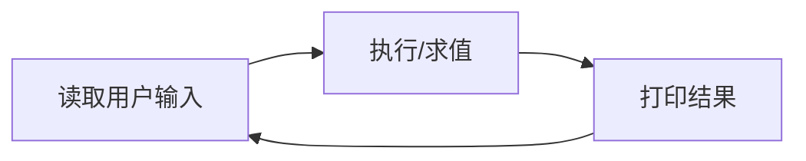
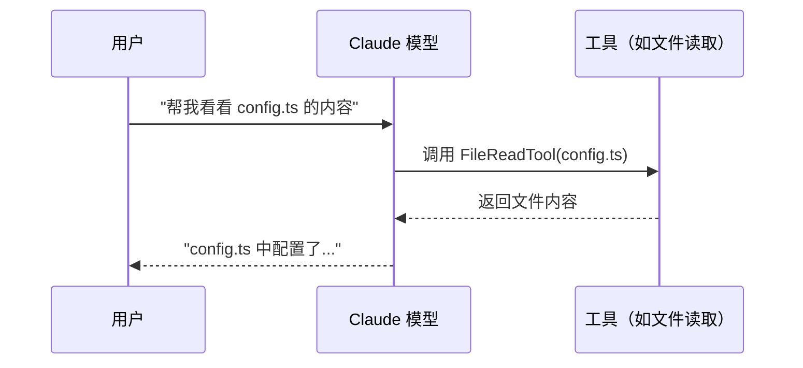
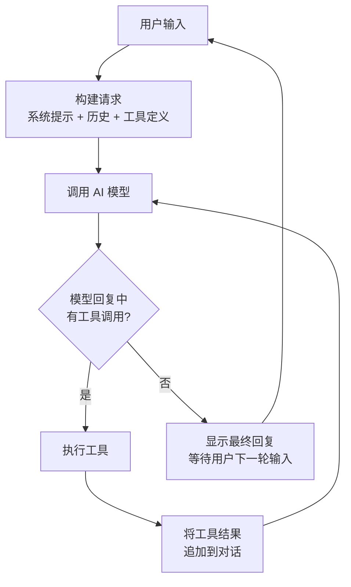

# 核心概念

> 阅读源码分析系列前，先了解这些基础概念。本文用通俗语言解释最常出现的术语。

## REPL

**REPL** = **R**ead-**E**val-**P**rint-**L**oop（读取-求值-打印-循环）。

一种交互式编程环境的工作模式：



你在终端里输入 `node` 或 `python` 进入的就是 REPL 环境——输入一行代码，回车，立刻看到结果。

Claude Code 的主界面就是一个 **REPL**：你输入问题，它调用 AI 模型处理，把回答显示出来，然后等你输入下一个问题。只不过它的"求值"步骤远比普通编程语言复杂——涉及 API 调用、工具执行、流式输出等。

## CLI

**CLI** = **C**ommand-**L**ine-**I**nterface（命令行界面）。

通过文本命令与程序交互的方式，而非鼠标点击图形界面。Claude Code 本身就是一个 CLI 工具——你在终端输入 `claude` 启动它，用键盘输入指令。

## SDK

**SDK** = **S**oftware **D**evelopment **K**it（软件开发工具包）。

为特定平台或服务提供的开发工具集合。比如 Claude Code 提供了 Agent SDK，让开发者可以构建自定义的 AI Agent。

## API 与 Streaming

**API** = **A**pplication **P**rogramming **I**nterface（应用程序编程接口）。

程序之间通信的约定。Claude Code 通过 Anthropic API 与 Claude 模型通信。

### Streaming（流式传输）

传统的 API 调用是"请求-等待-一次性返回全部结果"。**Streaming** 则是服务器一边生成结果，一边把部分内容发送给客户端。

```
传统方式:  请求 ──────────────────────> 等待... ──> 收到完整回复
流式方式:  请求 ──> 收到"你" ──> 收到"好" ──> 收到"，" ──> ...（逐步接收）
```

这样做的好处是用户不需要等整个回答生成完才能看到内容——像看视频一样"边下边播"。

### SSE

**SSE** = **S**erver-**S**ent **E**vents（服务器发送事件）。

实现 Streaming 的一种技术方案。服务器通过 HTTP 连接持续向客户端推送数据，每个数据块以 `data:` 开头。

Claude Code 使用 SSE 从 Anthropic API 接收模型的流式回复。

## stdio

**stdio** = **st**andard **I**nput/**O**utput（标准输入/输出）。

每个进程都有三个标准数据通道：

| 名称 | 缩写 | 作用 |
|------|------|------|
| 标准输入 | stdin | 读取用户输入 |
| 标准输出 | stdout | 输出正常内容 |
| 标准错误 | stderr | 输出错误信息 |

在 Claude Code 中，stdio 有一个重要用途：**进程间通信**。MCP 协议的 stdio 传输模式就是让两个进程通过 stdin/stdout 交换 JSON 消息，就像两个人通过管道传纸条。

## Tokens

**Token** 是 AI 模型处理文本的基本单位。

你可以粗略理解为：英文中约 4 个字符 ≈ 1 个 token，中文约 1-2 个汉字 ≈ 1 个 token。

为什么 tokens 重要？因为模型有处理上限——不是按"多少字"计算，而是按"多少 tokens"计算。这直接决定了：
- 一次对话能包含多少上下文
- 一次 API 调用要花多少钱

## Context Window（上下文窗口）

AI 模型单次能处理的最大 token 数量。

可以把 context window 想象成模型的"短期记忆容量"。Claude 的上下文窗口约 200K tokens。

当你和 Claude Code 聊得越来越久，对话历史越来越长，最终会 **撑满上下文窗口**。这时就需要 **Compact**——把旧的对话压缩成摘要，腾出空间继续对话。

## System Prompt（系统提示词）

发送给 AI 模型的一段特殊指令，用来设定模型的角色、行为规则和能力边界。

普通用户看到的是 Claude Code 的对话界面，但在每次 API 调用背后，系统提示词才是真正"指挥"模型行为的"隐藏指令"。Claude Code 的系统提示词有 **54KB**，包含了工具使用规则、安全策略、输出格式要求等。

```
┌─────────────────────────────┐
│  System Prompt（54KB）       │  ← 你看不到的部分
│  "你是 Claude Code..."       │
├─────────────────────────────┤
│  用户消息: "帮我修这个 bug"   │  ← 你输入的部分
├─────────────────────────────┤
│  助手回复: "让我看看代码..."  │  ← Claude 的回复
└─────────────────────────────┘
```

## Tool Use（工具使用）

让 AI 模型不仅能"说话"，还能"做事"。

工作流程：



模型不是直接执行代码，而是**输出一个"工具调用请求"**，Claude Code 的运行时收到后执行对应工具，再把结果返回给模型。模型根据工具结果继续思考和回复。

## Turn（轮次）

Agentic Loop 中的一次完整循环：用户输入 → 模型响应（可能包含多次工具调用）→ 最终回复。

一个 Turn 不等于一次 API 调用。如果模型在一次回复中调用了 3 个工具，那这 3 次工具调用+结果返回都属于同一个 Turn。

```
Turn 1: 用户提问 → 模型思考 → 调用工具A → 调用工具B → 最终回答
Turn 2: 用户追问 → 模型思考 → 最终回答（没调用工具）
```

## Agentic Loop（智能体循环）

Claude Code 的核心工作模式——一个不断循环的过程：



关键特点：**模型自己决定是否需要调用工具**。它可能一次回复就结束，也可能连续调用十几次工具才给出最终答案。这个自主决策的循环就是 "Agentic" 的含义。

## Compact（压缩）

当对话历史太长、接近上下文窗口上限时，Claude Code 会把旧的对话消息**压缩成一段摘要**，替换掉原始消息。

```
压缩前: [用户消息1] [助手回复1] [用户消息2] [助手回复2] ... [用户消息50] [助手回复50]
                                                          ↑ 全部在上下文中

压缩后: [对话摘要: "用户和助手讨论了项目结构..."] ... [用户消息45] [助手回复50]
           ↑ 摘要替代了前面的消息                              ↑ 只保留最近的
```

Claude Code 有三种压缩策略：
- **手动 Compact**：用户输入 `/compact` 触发
- **自动 Compact**：检测到上下文接近上限时自动触发
- **微 Compact**：更轻量的压缩，只移除最不重要的部分

## 下一节

理解了这些核心概念后，可以继续阅读：
- [React 与终端渲染基础](./frontend-basics) — 理解 Claude Code 的界面是怎么渲染出来的
- [协议与基础设施](./protocols-infra) — 理解 MCP、OAuth 等协议和基础设施概念
