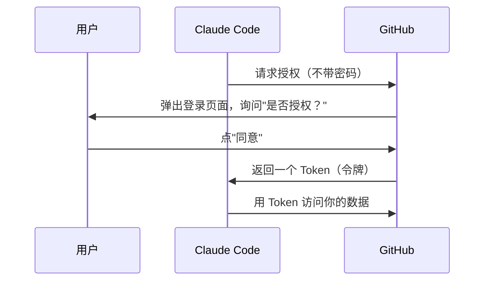

# 协议与基础设施

> Claude Code 涉及多种通信协议和基础设施概念。本文逐一解释。

## MCP（Model Context Protocol）

**模型上下文协议**——Anthropic 提出的开放标准，让 AI 应用能连接外部工具和数据源。

### 核心思想

AI 模型本身只能"说话"（生成文本），但实际工作中需要"做事"（读文件、查数据库、调用 API）。MCP 定义了一套标准协议，让 AI 应用可以：
- **发现**外部服务器提供了哪些工具和资源
- **调用**这些工具并获取结果
- **读取**服务器提供的数据资源

### 角色

MCP 中有两个角色：

```
┌──────────┐                    ┌──────────┐
│  Host    │ ←── MCP 协议 ──→  │  Server  │
│ (宿主)   │                    │ (服务端) │
└──────────┘                    └──────────┘

Host: Claude Code（发起请求的一方）
Server: 外部工具服务（提供工具的一方，如 GitHub、数据库等）
```

Claude Code 既是 MCP **Host**（连接外部 MCP 服务器获取工具），也是 MCP **Server**（对外暴露自己的工具，名称为 `claude/tengu`）。

### 传输方式

MCP 支持多种通信方式：

| 传输方式 | 说明 | 场景 |
|---------|------|------|
| **stdio** | 通过标准输入/输出通信 | 本地进程间通信 |
| **SSE** | 通过 HTTP Server-Sent Events | 远程服务器 |
| **StreamableHTTP** | 可流式传输的 HTTP | 远程服务器（SSE 的升级版） |

### 工具、资源与能力

MCP 定义了三种核心概念：
- **Tools（工具）**：AI 可以调用的函数（如搜索文件、执行查询）
- **Resources（资源）**：AI 可以读取的数据（如文档、配置）
- **Prompts（提示模板）**：预定义的提示词模板

## OAuth 2.0

一种让应用"代替用户"访问第三方服务的授权协议。

### 为什么需要 OAuth

假设你让 Claude Code 访问你的 GitHub。它需要你的 GitHub 权限，但你不想把 GitHub 密码直接给它。OAuth 解决的就是这个问题：



关键点：Claude Code 拿到的是 **Token**（临时通行证），不是你的密码。Token 可以随时撤销。

### 相关术语

| 术语 | 含义 |
|------|------|
| **Authorization Code** | 授权码，用户同意后服务器发给你的一串代码 |
| **PKCE** | Proof Key for Code Exchange，防止授权码被截获的安全增强 |
| **Token Refresh** | Token 过期后用 Refresh Token 获取新 Token |
| **IdP** | Identity Provider（身份提供商），如 GitHub、Google |
| **Keychain** | macOS 的安全存储系统，用来保存 Token |

## WebSocket

一种在单个 TCP 连接上实现**全双工通信**的协议。

与 HTTP 的区别：
- HTTP：请求-响应模式，客户端主动问，服务器才能答
- WebSocket：建立连接后，**双方随时可以主动发消息**

```
HTTP:    客户端 → 请求 → 服务器
         客户端 ← 响应 ← 服务器
         客户端 → 请求 → 服务器（每次都要重新请求）

WebSocket: 客户端 ←→ 服务器（连接建立后，双向实时通信）
```

Claude Code 的 Bridge 系统（VS Code 扩展、Claude Desktop 集成）使用 WebSocket 进行实时通信。

## JSON-RPC

一种基于 JSON 的远程过程调用（RPC）协议。

基本格式：发送一个 JSON 对象，包含方法名和参数，收到一个 JSON 对象作为结果。

```json
// 请求
{ "jsonrpc": "2.0", "method": "tools/list", "id": 1 }

// 响应
{ "jsonrpc": "2.0", "result": { "tools": [...] }, "id": 1 }
```

MCP 协议的消息格式就是基于 JSON-RPC 2.0。

## LSP（Language Server Protocol）

**语言服务器协议**——微软提出的开放标准，让代码编辑器能获得语言智能功能（补全、跳转定义、错误检查等）。

工作方式：

```
┌──────────┐         ┌──────────────┐
│ 编辑器   │ ← LSP → │ 语言服务器    │
│(VS Code) │  协议   │(处理代码分析) │
└──────────┘         └──────────────┘
```

好处：语言服务器只需实现一次，任何支持 LSP 的编辑器都能用。Claude Code 集成了 LSP，可以获取代码诊断信息（如 TypeScript 类型错误）来辅助编程。

## N-API 与 Native Addon

### Native Addon（原生插件）

Node.js/Bun 通常是 JavaScript/TypeScript 运行时，但有些操作用 JavaScript 太慢（如图片处理、键盘事件捕获）。这时可以用 C/C++/Rust 编写**原生插件**，通过特殊接口调用。

### N-API

Node.js 提供的原生插件 API，让 C/C++ 代码能和 JavaScript 代码互调。好处是 API 稳定——不随 Node.js 版本变化而变化。

Claude Code 的原生模块：
- `audio-capture` — 音频采集（语音模式）
- `image-processor` — 图片处理（截图识别）
- `modifiers-napi` — 键盘修饰键检测
- `url-handler` — URL 协议处理

## Feature Flags（特性开关）

一种软件工程实践：通过配置开关控制功能是否启用，而不是通过代码分支。

```
// 不用 feature flag 的做法（需要重新部署）
if (isNewUser) { showNewUI() }

// 用 feature flag 的做法（可以远程开关）
if (featureFlags.isEnabled('new_ui')) { showNewUI() }
```

好处：
- **安全灰度**：先对 1% 用户开放，没问题再扩大
- **快速回滚**：发现问题立刻关闭，不需要回滚代码
- **A/B 测试**：对比新旧方案的效果

Claude Code 使用两种 Feature Flag：
- **运行时**：通过 GrowthBook 平台远程控制
- **编译时**：通过 `feature()` 在构建时决定是否包含代码（DCE）

## OpenTelemetry（OTel）

一个开源的**可观测性**框架，提供统一的 API 来收集：
- **Traces**（追踪）— 请求的完整链路（从用户输入到 API 调用到工具执行）
- **Metrics**（指标）— 计数、计时等统计数据
- **Logs**（日志）— 结构化日志

Claude Code 使用 OpenTelemetry 来收集性能数据和遥测信息，帮助开发团队了解系统行为。

## DCE 与 Tree-shaking

### Dead Code Elimination（死代码消除）

编译器/打包工具自动移除永远不会被执行的代码。

```javascript
// 源码
if (false) {
  console.log('这行永远不会执行')
}
console.log('这行会执行')

// DCE 后
console.log('这行会执行')
// 那个 if 块整个被删除了
```

### Tree-shaking

基于 ES Module 静态分析的死代码消除。打包工具分析 `import/export` 关系，移除没有被使用的导出。

```javascript
// utils.js
export function used() { ... }
export function unused() { ... }  // 没人 import 这个

// 打包后：unused() 被移除
```

Claude Code 通过 Bun 的 `feature()` 函数实现编译时 DCE——当 feature flag 为 false 时，整块代码在构建时就被移除，不会出现在最终产物中。

## 下一节

掌握了这些基础概念后，建议按以下顺序阅读源码分析：
1. [项目架构总览](./architecture-overview) — 整体结构
2. [核心查询循环](./core-query-loop) — 核心工作机制
3. [工具系统](./tool-system) — 工具与命令
