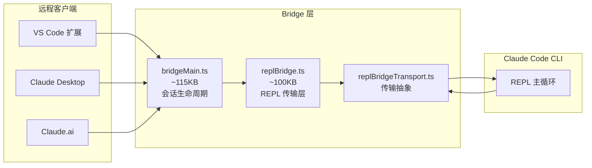

本文分析 Claude Code 的状态管理体系和基础设施层。这套系统负责管理应用状态、配置加载、记忆存储、远程桥接和插件扩展，是 [项目架构总览](./architecture-overview) 中"运行时框架"层的核心组成部分，同时也为 [多智能体系统](./multi-agent-system) 提供状态共享和进程间通信能力。

## createStore -- 轻量状态管理

Claude Code 没有使用 Redux 或 Zustand，而是自建了一套极简的响应式状态管理方案，定义在 `state/store.ts`（仅 35 行）：

```typescript
type Listener = () => void
type OnChange<T> = (args: { newState: T; oldState: T }) => void

export type Store<T> = {
  getState: () => T
  setState: (updater: (prev: T) => T) => void
  subscribe: (listener: Listener) => () => void
}

export function createStore<T>(
  initialState: T,
  onChange?: OnChange<T>,
): Store<T> {
  let state = initialState
  const listeners = new Set<Listener>()

  return {
    getState: () => state,
    setState: (updater: (prev: T) => T) => {
      const prev = state
      const next = updater(prev)
      if (Object.is(next, prev)) return
      state = next
      onChange?.({ newState: next, oldState: prev })
      for (const listener of listeners) listener()
    },
    subscribe: (listener: Listener) => {
      listeners.add(listener)
      return () => listeners.delete(listener)
    },
  }
}
```

核心设计要点：

- **函数式更新**：`setState` 接收 `(prev: T) => T` 更新函数，而非直接传入新状态值。这与 React 的 `useState` 保持一致的 API 风格。
- **引用相等性检查**：使用 `Object.is()` 判断新旧状态是否相同，避免不必要的重渲染和通知。
- **订阅/取消模式**：`subscribe` 返回取消函数（`() => void`），遵循 React `useEffect` 的清理模式。
- **可选的 onChange 回调**：在状态变化时执行副作用，但不影响订阅者通知流程。
- **泛型约束**：`Store<T>` 是完全泛型的，可以在不同场景复用。

这种设计与 Zustand 的核心理念非常相似，但更加精简——没有中间件系统、没有 computed 状态、没有异步 action 支持，完全服务于 Claude Code 自身的需求。

## AppState -- 全局应用状态

AppState 是 Claude Code 的 React 层全局状态，由三个文件协同管理：

### 状态定义：`state/AppStateStore.ts`（约 21KB）

定义了 `AppState` 类型和默认值。状态结构覆盖了应用的所有 UI 面和交互层：

| 状态分组 | 关键字段 | 说明 |
|---------|---------|------|
| **模型配置** | `mainLoopModel`, `mainLoopModelForSession` | 当前使用和会话级别的模型设置 |
| **权限管理** | `toolPermissionContext` | 工具权限上下文，含权限模式（bypass/plan/normal） |
| **任务系统** | `tasks`, `foregroundedTaskId`, `viewingAgentTaskId` | 子 agent 任务注册表和视图焦点 |
| **Agent 注册** | `agentNameRegistry` | agent 名称到 ID 的映射，支持 SendMessage 按名路由 |
| **MCP 连接** | `mcp.clients`, `mcp.tools`, `mcp.resources` | MCP 服务器连接状态和暴露的工具/资源 |
| **插件系统** | `plugins.enabled`, `plugins.disabled`, `plugins.errors` | 已加载的插件及其状态 |
| **Speculation** | `speculationState` | 推测执行状态（预生成响应以降低延迟） |
| **Bridge** | `replBridgeEnabled`, `replBridgeConnected`, `replBridgeSessionUrl` | 远程桥接状态机 |
| **远程模式** | `remoteSessionUrl`, `remoteConnectionStatus`, `remoteBackgroundTaskCount` | `claude assistant` 查看器状态 |
| **设置** | `settings`, `verbose`, `isBriefOnly` | 用户偏好设置 |

状态类型使用 `DeepImmutable<T>` 包装不可变部分，但 `tasks` 和 `agentNameRegistry` 等包含函数类型的字段被排除在外。

### React 集成：`state/AppState.tsx`（约 23KB）

`AppStateProvider` 组件将 store 注入 React 组件树：

```typescript
export function AppStateProvider({ children, initialState, onChangeAppState }) {
  // 防止嵌套
  if (hasAppStateContext) {
    throw new Error("AppStateProvider can not be nested")
  }
  // 使用 useState 持有 store 引用（生命周期内稳定）
  const [store] = useState(() => createStore(
    initialState ?? getDefaultAppState(),
    onChangeAppState
  ))
  // ...
  return (
    <AppStoreContext.Provider value={store}>
      <MailboxProvider>
        <VoiceProvider>{children}</VoiceProvider>
      </MailboxProvider>
    </AppStoreContext.Provider>
  )
}
```

关键设计：

- **单例保护**：通过 `HasAppStateContext` 检测防止 Provider 嵌套
- **Context 传播**：`AppStoreContext` 让任意子组件通过 `useContext` 访问 store
- **嵌套 Provider**：`MailboxProvider`（agent 间通信邮箱）和 `VoiceProvider`（语音模式，ant-only）包裹在内部
- **Settings 联动**：通过 `useSettingsChange` 监听配置变更并同步到 store

### 状态选择器：`state/selectors.ts`

提供纯函数式的派生状态计算：

- `getViewedTeammateTask()` — 获取当前查看的 teammate 任务
- `getActiveAgentForInput()` — 判断用户输入应路由到哪个 agent（leader / viewed / named）

### 状态变更处理：`state/onChangeAppState.ts`

监听 AppState 变化并执行副作用，是 AppState 与外部系统同步的桥梁：

- **权限模式同步**：监听 `toolPermissionContext.mode` 变化，通知 CCR/SDK 外部元数据
- **模型覆盖同步**：将 `mainLoopModelOverride` 写入 bootstrap state
- **API Key 缓存清除**：配置变更时清除认证缓存

### Speculation 状态

`AppStateStore.ts` 中定义了 `SpeculationState`，这是 Claude Code 降低感知延迟的关键机制。Speculation 在用户输入完成前预测可能的请求并预生成响应：

```typescript
type SpeculationState =
  | { status: 'idle' }
  | {
      status: 'active'
      id: string
      abort: () => void
      startTime: number
      messagesRef: { current: Message[] }
      writtenPathsRef: { current: Set<string> }
      boundary: CompletionBoundary | null
      suggestionLength: number
      toolUseCount: number
      isPipelined: boolean
      contextRef: { current: REPLHookContext }
    }
```

活跃状态使用 `messagesRef` 和 `writtenPathsRef` 等可变引用（`{ current: T }`），避免每次消息追加时的数组扩散开销。`boundary` 字段标记预生成结果的边界（完成、bash 命令、文件编辑或工具拒绝），`abort` 方法允许在预测不准确时取消预生成。`CompletionBoundary` 类型记录了边界类型和时间戳，用于在推测命中时快速呈现结果。

## Bootstrap State -- 启动状态

`bootstrap/state.ts`（约 56KB）定义了一套完全独立于 React 的全局可变状态，在进程启动时初始化。文件开头的注释明确警示：

```
// DO NOT ADD MORE STATE HERE - BE JUDICIOUS WITH GLOBAL STATE
```

### 与 AppState 的区别

| 维度 | AppState | Bootstrap State |
|------|----------|-----------------|
| 实现方式 | React Context + Store | 模块级 `let` 变量 |
| 订阅机制 | `subscribe()` 通知 React 重渲染 | 直接 `get*()` 读取 |
| 生命周期 | 组件挂载/卸载 | 进程启动/退出 |
| 使用者 | UI 组件 | 查询引擎、服务层 |
| 可变性 | 不可变（DeepImmutable） | 可变（直接赋值） |

### 核心状态字段

- **会话标识**：`sessionId`, `parentSessionId`（会话谱系追踪，如 plan mode → implementation）
- **路径管理**：`originalCwd`, `projectRoot`, `cwd`（projectRoot 在启动时确定，不随 worktree 变更）
- **计费追踪**：`totalCostUSD`, `modelUsage`, `totalAPIDuration`
- **性能计数器**：`turnHookDurationMs`, `turnToolDurationMs`, `turnClassifierDurationMs`
- **遥测**：OpenTelemetry 集成 — `meter`, `meterProvider`, `tracerProvider`, `loggerProvider` 及各种 AttributedCounter
- **API 调试**：`lastAPIRequest`, `lastAPIRequestMessages`（用于 /share 序列化）
- **安全**：`sessionBypassPermissionsMode`, `sessionTrustAccepted`, `sessionPersistenceDisabled`
- **Agent 颜色**：`agentColorMap`, `agentColorIndex`（为多 agent 分配可视化颜色）
- **Hook 注册**：`registeredHooks` — SDK 回调和插件原生 hook 的统一注册表
- **Skill 追踪**：`invokedSkills` — 跨 compaction 保留已调用的 skill 信息
- **计划缓存**：`planSlugCache` — sessionId 到 plan slug 的映射

## 配置系统

### 多层配置加载：`utils/config.ts`

配置系统采用多层优先级设计，从低到高：

1. **全局配置**：`~/.claude/config.json` — 用户级默认值
2. **项目配置**：`.claude/settings.json` — 提交到版本库的项目共享设置
3. **本地配置**：`.claude/settings.local.json` — 不提交的个人覆盖
4. **命令行标志**：`--model`, `--allowedTools` 等 CLI 参数
5. **环境变量**：`CLAUDE_CODE_*` 前缀的环境变量

`config.ts` 中的 `ProjectConfig` 类型记录了项目级持久化数据，包括：

- 上次会话指标（API 耗时、token 用量、成本、代码行变更）
- 信任对话框状态
- MCP 服务器启用/禁用列表
- Worktree 会话管理

### 配置加载的防递归保护

`config.ts` 中存在一个 `insideGetConfig` 布尔守卫，防止 `getConfig` → `logEvent` → `getGlobalConfig` → `getConfig` 的无限递归。这在配置文件损坏时会触发——`logEvent` 的采样检查会读取 GrowthBook features，而 GrowthBook 又调用 `getConfig`。

### AccountInfo 类型

`config.ts` 还定义了 `AccountInfo` 类型，包含账户 UUID、邮箱、组织信息、订阅状态和计费类型等用户档案数据，由 `services/oauth/getOauthProfile.ts` 填充。

### 设置系统：`utils/settings/`

`settings/` 目录（17 个文件）提供了比 `config.ts` 更精细的设置管理：

- `settings.ts` — 核心设置加载逻辑，支持 `getInitialSettings()` 和 `getSettingsForSource(source)` 按来源查询
- `constants.ts` — 设置来源枚举（`userSettings`, `localSettings`, `projectSettings`, `flagSettings`, `policySettings`）
- `applySettingsChange.ts` — 将外部设置变更应用到 AppState
- `validation.ts` / `validationTips.ts` — 设置值校验
- `managedPath.ts` — MDM（移动设备管理）策略路径解析
- `mdm/` — 企业级 MDM 策略管理
- `toolValidationConfig.ts` — 工具相关的设置校验配置
- `permissionValidation.ts` — 权限相关设置的校验逻辑

### 配置迁移：`migrations/`

12 个迁移文件处理版本升级时的配置格式变更，如模型名称更新（`migrateFennecToOpus.ts`、`migrateSonnet45ToSonnet46.ts`）和功能开关迁移（`migrateReplBridgeEnabledToRemoteControlAtStartup.ts`）。迁移确保用户升级 Claude Code 后旧配置能平滑过渡到新格式。

## 认证系统

- **API Key 管理**：`utils/auth.ts` 提供 API key helper 缓存，支持 AWS 和 GCP 凭证
- **OAuth 流程**：`services/oauth/` 包含完整的 OAuth 认证实现
  - `client.ts` — OAuth 客户端
  - `auth-code-listener.ts` — 本地认证码监听（用于浏览器回调）
  - `crypto.ts` — PKCE 加密
  - `getOauthProfile.ts` — 获取用户档案
- **会话持久化**：`utils/sessionStorage.ts` 管理会话到磁盘的持久化
- **Bridge 认证**：`bridge/trustedDevice.ts` 和 `bridge/jwtUtils.ts` 管理远程桥接的设备信任和 token 刷新
- **入口认证**：支持通过文件描述符传入 token（`oauthTokenFromFd`, `apiKeyFromFd`），便于 SDK 和容器化场景
- **多凭证支持**：`clearApiKeyHelperCache`, `clearAwsCredentialsCache`, `clearGcpCredentialsCache` 分别管理不同云厂商的凭证缓存

## Memory 系统

Memory 系统是 Claude Code 实现"跨会话记忆"的核心机制，让 agent 能在多次对话间保留关键上下文。

### CLAUDE.md 发现与加载：`memdir/memdir.ts`

`memdir/` 模块负责从文件系统发现和加载 CLAUDE.md 文件。入口文件名为 `MEMORY.md`，有严格的大小限制：

- 最大行数：200 行
- 最大字节数：25,000 字节（约 125 字符/行 * 200 行的上限）

超出限制时进行截断并追加警告信息。

### 记忆目录路径：`memdir/paths.ts`

记忆存储路径的解析优先级：

1. `CLAUDE_COWORK_MEMORY_PATH_OVERRIDE` 环境变量（Cowork 场景的完整路径覆盖）
2. `autoMemoryDirectory` 设置项（仅限策略/标志/本地/用户等可信来源，排除 `projectSettings` 以防止恶意仓库劫持）
3. 默认路径：`~/.claude/projects/{sanitized-git-root}/memory/`

路径解析包含严格的安全校验：拒绝相对路径、根路径、Windows 盘符根、UNC 路径和包含 null 字节的路径。

### 记忆类型：`memdir/memoryTypes.ts`

定义了四种记忆类型，每种都有明确的使用场景和作用域：

| 类型 | 作用域 | 用途 |
|------|--------|------|
| `user` | 始终 private | 用户角色、目标、知识背景 |
| `feedback` | 默认 private，项目级约定用 team | 用户给出的行为指导（纠正和确认） |
| `project` | 偏向 team | 项目工作进展、目标、截止日期 |
| `reference` | 通常 team | 外部系统资源指针（Linear、Grafana 等） |

系统还定义了明确的"不应记忆"规则：代码模式、架构、git 历史、调试方案等可从当前项目状态推导的信息不应存入记忆。

### 记忆开关与特性门控

`memdir/paths.ts` 中的 `isAutoMemoryEnabled()` 控制记忆系统的启用状态，优先级链为：

1. `CLAUDE_CODE_DISABLE_AUTO_MEMORY` 环境变量（1/true → 关闭）
2. `CLAUDE_CODE_SIMPLE`（`--bare` 模式）→ 关闭
3. CCR 远程模式无持久化存储 → 关闭
4. `settings.json` 中的 `autoMemoryEnabled` 字段
5. 默认：启用

此外，`isExtractModeActive()` 控制后台 extract-memories agent 是否运行。该后台 agent 在主 agent 的 turn 结束时异步提取记忆，主 agent 的提示词始终包含完整的记忆保存指令——当主 agent 自行写入记忆时，后台 agent 会跳过该范围。

### 会话记忆：`services/SessionMemory/`

- `sessionMemory.ts` — 会话级别的记忆持久化
- `sessionMemoryUtils.ts` — 记忆操作工具函数
- `prompts.ts` — 记忆相关的提示词模板

### 记忆注入

记忆内容通过系统提示词注入到 agent 上下文中。`memdir/memoryTypes.ts` 中定义的 `WHEN_TO_ACCESS_SECTION` 和 `TRUSTING_RECALL_SECTION` 指导 agent 在何时以及如何使用记忆，包括记忆漂移警告（"The memory says X exists" is not the same as "X exists now"）。

记忆系统还支持两种运行模式：

- **INDIVIDUAL-ONLY 模式**：单一目录，所有记忆混合存储，提示词中不区分 private/team
- **COMBINED 模式**：private 和 team 目录分离，提示词中使用 `<scope>` 标签指导 agent 选择存储位置

每种模式有独立的提示词段落（`TYPES_SECTION_INDIVIDUAL` / `TYPES_SECTION_COMBINED`），但 `WHAT_NOT_TO_SAVE_SECTION` 在两种模式下保持一致。

## Bridge 系统

Bridge 系统是 Claude Code 实现远程会话集成的基础设施，位于 `bridge/` 目录（30 个文件），支持 VS Code 扩展、Claude Desktop 和 Claude.ai 等远程客户端。

### 核心架构



### 关键文件

| 文件 | 大小 | 职责 |
|------|------|------|
| `bridgeMain.ts` | ~115KB | 核心 bridge 逻辑：会话创建、轮询、认证、重连 |
| `replBridge.ts` | ~100KB | REPL bridge 传输：将 CLI 的输入/输出桥接到远程端 |
| `replBridgeTransport.ts` | — | 传输抽象层，V1/V2 两种协议实现 |
| `bridgeApi.ts` | — | Bridge API 客户端，HTTP 调用封装 |
| `bridgeMessaging.ts` | — | 消息处理：入站消息解析、控制请求处理 |
| `bridgeConfig.ts` | — | Bridge 配置管理 |
| `bridgePermissionCallbacks.ts` | — | 远程权限回调（权限请求转发到远程端审批） |
| `workSecret.ts` | — | 工作密钥编解码和 SDK URL 构建 |
| `jwtUtils.ts` | — | JWT token 刷新调度器 |
| `sessionRunner.ts` | — | 会话进程创建和管理 |
| `capacityWake.ts` | — | 容量唤醒信号（空闲时关闭连接，有请求时唤醒） |

### 通信机制

Bridge 支持 V1 和 V2 两种传输协议（`createV1ReplTransport` / `createV2ReplTransport`）。V2 协议通过 WebSocket 实现双向实时通信，V1 使用轮询机制。`HybridTransport` 在 `cli/transports/` 中提供了混合传输实现。

`FlushGate` 确保消息在连接断开前完整发送，避免数据丢失。`BoundedUUIDSet` 用于去重已处理的消息 ID。

## 插件与 Skill 系统

### 插件系统：`plugins/`

插件系统管理 Claude Code 的扩展能力：

- `builtinPlugins.ts` — 内置插件注册表，使用 `{name}@builtin` 格式的插件 ID 区分内置和 marketplace 插件
- `bundled/` — 打包的内置插件定义

内置插件与 bundled skill 的区别：

| 维度 | 内置插件 | Bundled Skill |
|------|---------|--------------|
| UI 展示 | `/plugin` 管理界面 | 直接作为命令可用 |
| 用户控制 | 可启用/禁用（持久化到用户设置） | 始终可用 |
| 组成部分 | 可包含多个 skill、hook、MCP server | 单一功能 |

### Skill 系统：`skills/`

Skill 是 Claude Code 的命令扩展机制，支持从多个来源加载：

- **内置 skill**：`skills/bundled/`（17 个），包括 `simplify`（代码审查）、`commit`（提交）、`loop`（循环任务）、`schedule`（定时任务）、`remember`（记忆管理）、`verify`（验证）等
- **项目 skill**：`.claude/skills/` 目录下用户自定义的 skill
- **MCP skill**：`skills/mcpSkillBuilders.ts` 从 MCP 服务器动态发现和构建 skill
- **Skill 加载**：`skills/loadSkillsDir.ts` 负责从文件系统扫描和加载 skill 定义
- **注册表**：`skills/bundledSkills.ts` 维护所有可用 skill 的注册表

每个 skill 定义包含 frontmatter 元数据（描述、参数名、触发条件等），通过 `parseFrontmatter` 解析后注册为可用的 slash command 或隐式触发规则。

## 关键文件参考

| 文件路径 | 大小 | 职责 |
|---------|------|------|
| `state/store.ts` | 35 行 | 轻量响应式 store 实现 |
| `state/AppStateStore.ts` | ~21KB | AppState 类型定义和默认值 |
| `state/AppState.tsx` | ~23KB | React Context Provider |
| `state/selectors.ts` | — | 派生状态选择器 |
| `state/onChangeAppState.ts` | — | 状态变更副作用处理 |
| `bootstrap/state.ts` | ~56KB | 进程级全局可变状态 |
| `utils/config.ts` | — | 多层配置加载和管理 |
| `utils/settings/settings.ts` | — | 设置加载和来源管理 |
| `memdir/memdir.ts` | — | CLAUDE.md/MEMORY.md 发现和加载 |
| `memdir/paths.ts` | — | 记忆目录路径解析 |
| `memdir/memoryTypes.ts` | — | 记忆类型定义和提示词 |
| `services/SessionMemory/` | — | 会话记忆持久化 |
| `bridge/bridgeMain.ts` | ~115KB | 远程桥接核心逻辑 |
| `bridge/replBridge.ts` | ~100KB | REPL 桥接传输 |
| `plugins/builtinPlugins.ts` | — | 内置插件注册表 |
| `skills/loadSkillsDir.ts` | — | Skill 文件系统加载 |
| `skills/bundledSkills.ts` | — | 内置 Skill 注册表 |
| `migrations/` | 12 个文件 | 配置格式迁移 |
