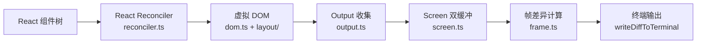
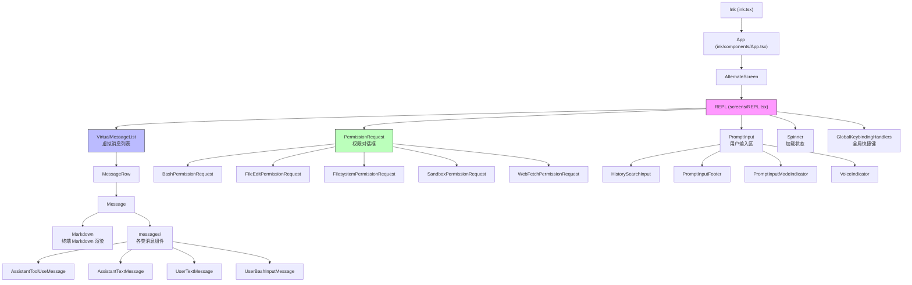

Claude Code 的用户界面完全在终端中运行，基于 React + Ink 构建。但它并非简单使用 Ink 库——Claude Code fork 了 Ink 并做了大量深度定制，以支撑其复杂的交互式终端 UI 需求。本文从渲染管线、组件架构、Hooks 体系三个层面剖析终端渲染系统。

## 自定义 Ink 终端渲染器

### 渲染管线概览

Claude Code 的终端渲染遵循经典的 React 渲染管线，但每个环节都经过深度定制：

核心流程：React reconciler 将组件树 reconciliation 为虚拟 DOM 节点，Yoga 引擎完成布局计算，`render-node-to-output.ts` 将节点树渲染为输出操作（write/clip/blit/clear），`output.ts` 将操作应用到 Screen 缓冲区，最后 `frame.ts` 对比前后两帧的差异，仅输出变化的单元格到终端。

### Ink 核心：`ink/ink.tsx` (~251KB)

`ink/ink.tsx` 是 Ink 的主入口，导出 `Ink` 类，它是整个终端渲染系统的核心控制器。从源码可以看到它管理的状态非常丰富：

- **双缓冲帧管理**：`frontFrame` / `backFrame` 交替使用，配合 `FRAME_INTERVAL_MS` 节流渲染频率
- **内存池系统**：`stylePool`、`charPool`（CharPool）、`hyperlinkPool`（HyperlinkPool）实现字符串 interning，减少内存分配
- **文本选区**：`SelectionState` 管理鼠标文本选择，支持词选、行选、区域选
- **搜索高亮**：`searchHighlightQuery` 和 `searchPositions` 支持终端内搜索
- **Alternate Screen**：`altScreenActive` 控制备用屏幕缓冲区模式
- **鼠标追踪**：`hoveredNodes` 跟踪指针下方的 DOM 节点，实现 hover 效果

Ink 通过 `signal-exit` 监听进程退出，在退出前恢复终端状态。

### 关键子系统

| 文件 | 职责 |
|------|------|
| `ink/reconciler.ts` | React reconciler 的自定义实现，桥接 React 与 Ink 的 DOM |
| `ink/renderer.ts` | 帧渲染器，接收 RenderOptions 产出 Frame，处理双缓冲和布局偏移检测 |
| `ink/screen.ts` | 终端屏幕缓冲区管理——CharPool/HyperlinkPool/StylePool 的定义所在，`createScreen()` 创建屏幕缓冲，`setCellAt()` 写入单元格，`blitRegion()` 区域复制，`diffEach()` 逐单元对比 |
| `ink/output.ts` | 输出渲染——收集 Write/Clip/Blit/Clear/Shift 等操作，将文本和样式应用到 Screen 缓冲区。`ClusteredChar` 类型预计算了字素簇宽度、styleId 和 hyperlink，避免每帧重复计算 |
| `ink/render-node-to-output.ts` | 节点到终端的渲染——递归遍历虚拟 DOM 树，将每个节点的文本、边框、样式输出到 Output 对象。支持布局偏移检测（`didLayoutShift`） |
| `ink/frame.ts` | 帧差异计算——对比前后两帧的 Screen 缓冲区，生成最小化终端更新序列 |
| `ink/parse-keypress.ts` | 按键解析——将终端原始输入转换为 `ParsedKey` 事件，支持 CSI u（Kitty 键盘协议）、modifyOtherKeys、粘贴模式、功能键等 |
| `ink/selection.ts` | 文本选区——管理鼠标选择状态，支持词选、行选、shift 扩展选区、URL 检测 |
| `ink/searchHighlight.ts` | 搜索高亮——在终端屏幕上反转匹配文本的样式 |
| `ink/termio/` | 终端控制序列层——`ansi.ts`（基础定义）、`csi.ts`（CSI 序列）、`dec.ts`（DEC 序列，如 alternate screen、鼠标追踪）、`osc.ts`（OSC 序列，如剪贴板、tab 标题） |
| `ink/node-cache.ts` | 节点缓存——缓存 Yoga 布局结果，避免重复计算。`pendingClears` 追踪需要清除的缓存条目 |
| `ink/optimizer.ts` | 补丁优化——合并和去重 `Diff[]` 补丁，减少终端写入次数 |
| `ink/hit-test.ts` | 命中测试——根据鼠标坐标找到对应的 DOM 节点，用于 click/hover 事件分发 |
| `ink/focus.ts` | 焦点管理——`FocusManager` 管理终端 UI 的焦点状态 |

### 终端能力支持

Claude Code 的 Ink fork 支持以下终端高级特性：

- **Alternate Screen**：通过 `ENTER_ALT_SCREEN` / `EXIT_ALT_SCREEN` 进入/退出备用屏幕缓冲区，退出时自动恢复原始终端内容
- **鼠标追踪**：mode 1003（motion tracking），通过 `ENABLE_MOUSE_TRACKING` / `DISABLE_MOUSE_TRACKING` 启停
- **Kitty 键盘协议**：`ENABLE_KITTY_KEYBOARD` / `DISABLE_KITTY_KEYBOARD`，支持精确的按键编码（含修饰键组合）
- **modifyOtherKeys**：`ENABLE_MODIFY_OTHER_KEYS` / `DISABLE_MODIFY_OTHER_KEYS`，兼容 xterm/Ghostty 的按键报告模式
- **OSC 8 超链接**：终端内的可点击超链接
- **Tab 标题**：`supportsTabStatus()` 检测并设置终端 tab 标题和状态图标
- **剪贴板**：`setClipboard()` 通过 OSC 52 写入系统剪贴板
- **文本选择**：完整的鼠标文本选择、复制功能

### 虚拟 DOM 与布局引擎

Ink 的虚拟 DOM 定义在 `ink/dom.ts` 中。`DOMElement` 是核心节点类型，包含以下关键字段：

- **nodeName**：元素类型，支持 `ink-root`、`ink-box`、`ink-text`、`ink-virtual-text`、`ink-link`、`ink-progress`、`ink-raw-ansi` 七种元素名
- **yogaNode**：Yoga 布局节点引用，由 `ink/layout/yoga.ts` 创建
- **style**：CSS-like 样式对象（flexbox、padding、margin、颜色等）
- **scrollTop / pendingScrollDelta**：滚动状态，`pendingScrollDelta` 在每帧最多消耗 `SCROLL_MAX_PER_FRAME` 行，避免快速滑动时一次跳太多
- **dirty**：脏标记，reconciler 在属性变更时设置，渲染后清除
- **isHidden**：隐藏标记，reconciler 的 `hideInstance/unhideInstance` 设置
- **_eventHandlers**：事件处理器（与 attributes 分离存储，避免处理器身份变化触发不必要的脏标记）

布局引擎使用 Facebook 的 **Yoga**（`src/native-ts/yoga-layout/`），通过 `ink/layout/yoga.ts` 桥接。Yoga 是一个跨平台的 Flexbox 布局引擎，Ink 将其用于终端 UI 的布局计算——这与 Web 端的 Flexbox 布局原理相同，只是输出的是终端的行/列坐标。

### 帧渲染与差异输出

`ink/renderer.ts` 中的 `createRenderer()` 函数是帧渲染的入口，它执行以下步骤：

1. **Yoga 布局计算**：调用 `yogaNode.calculateLayout()` 计算所有节点的位置和尺寸
2. **节点树渲染**：调用 `renderNodeToOutput()` 递归遍历节点树，生成输出操作
3. **输出应用**：`output.ts` 的 `get()` 方法将操作应用到 Screen 缓冲区
4. **帧差异**：`frame.ts` 对比前后两帧的 Screen 缓冲区，生成 `Diff[]` 数组

`Frame` 类型包含三个核心字段：`screen`（屏幕缓冲区）、`viewport`（可视区域尺寸）、`cursor`（光标位置）。`FrameEvent` 记录了每帧的性能指标——包含 `renderer`（布局+渲染耗时）、`diff`（差异计算耗时）、`optimize`（补丁合并耗时）、`write`（终端写入耗时）四个阶段。

差异输出通过 `writeDiffToTerminal()` 函数完成，它会将 `Diff[]` 序列化为 ANSI 转义序列写入 stdout。Ink 还通过 `SYNC_OUTPUT_SUPPORTED` 检测终端是否支持同步输出模式，以减少渲染闪烁。

### Ink 内置组件

Ink 自身提供了一组基础组件（`ink/components/`），Claude Code 在此基础上构建上层 UI：

| 组件 | 职责 |
|------|------|
| `Box.tsx` | Flexbox 容器——对应 `ink-box` DOM 节点，支持 flexDirection、padding、margin 等布局属性 |
| `Text.tsx` | 文本渲染——对应 `ink-text` DOM 节点，支持颜色、加粗、斜体、下划线等样式 |
| `Newline.tsx` | 换行符 |
| `Spacer.tsx` | 弹性间距——填充可用空间 |
| `ScrollBox.tsx` | 滚动容器——支持 `scrollTop` 和 sticky 滚动 |
| `Link.tsx` | 超链接——OSC 8 格式的终端超链接 |
| `RawAnsi.tsx` | 原始 ANSI——直接输出 ANSI 转义序列，不做任何处理 |
| `AlternateScreen.tsx` | 备用屏幕——切换到 alternate screen buffer |
| `NoSelect.tsx` | 不可选区域——标记文本选择时跳过的区域 |
| `Button.tsx` | 按钮——支持 onClick 事件 |
| `ErrorOverview.tsx` | 错误概览——错误信息的格式化展示 |

### Ink Hooks

Ink 还提供了一组底层 Hook（`ink/hooks/`），供上层组件使用：

| Hook | 职责 |
|------|------|
| `use-input.ts` | 按键输入——监听终端按键事件 |
| `use-stdin.ts` | 标准输入——访问 stdin 流 |
| `use-app.ts` | Ink App——获取 Ink 实例引用 |
| `use-stdout.ts` | 标准输出——写入原始文本到 stdout |
| `use-terminal-focus.ts` | 终端焦点——监听终端窗口焦点变化 |
| `use-terminal-title.ts` | 终端标题——设置终端 tab 标题 |
| `use-tab-status.ts` | Tab 状态——设置终端 tab 状态图标（如 spinner） |
| `use-terminal-viewport.ts` | 终端视口——获取终端可视区域范围 |
| `use-declared-cursor.ts` | 声明光标——组件声明自己拥有光标 |
| `use-selection.ts` | 文本选区——访问当前文本选择状态 |
| `use-search-highlight.ts` | 搜索高亮——控制搜索高亮的显示 |
| `use-animation-frame.ts` | 动画帧——请求动画帧回调 |
| `use-interval.ts` | 定时器——设置/清除 interval |

### 为什么 Fork Ink

从代码中可以看到大量 Ink 原版不具备的特性：双缓冲帧系统、文本选区、搜索高亮、Kitty 键盘协议、BiDi 文本重排（`bidi.ts`）、内存池系统、布局偏移检测等。这些功能是 Claude Code 复杂终端 UI（虚拟滚动、Markdown 渲染、权限对话框、Diff 查看器）的基础支撑。Ink 的 fork 程度极深——`ink.tsx` 本身就有 ~251KB，加上 `screen.ts`、`output.ts`、`render-node-to-output.ts`、`selection.ts` 等配套文件，几乎重写了整个渲染层。

## REPL 屏幕

### `screens/REPL.tsx` (~895KB)

这是整个项目最大的单文件，也是用户交互的核心。从其 import 列表可以看出它集成了几乎所有子系统：

**核心职责**：

- **消息显示**：渲染用户消息、助手回复、工具调用结果、系统消息等
- **用户输入**：通过 PromptInput 组件处理文本输入，支持多模式（普通、Vim、搜索等）
- **权限对话框**：工具调用时的权限请求弹窗（PermissionRequest）
- **虚拟滚动**：通过 VirtualMessageList 实现长对话的高效渲染
- **命令处理**：斜杠命令（/help、/compact 等）的解析和执行
- **会话管理**：token 预算、成本追踪、会话标题生成
- **流式响应**：处理来自 API 的 SSE 流式消息更新
- **快捷键**：全局和命令级键盘快捷键

REPL 通过条件导入（`feature()` 门控 + `require()`）实现了大量功能的按需加载，包括语音模式、挫折检测、Ant 内部工具等，使外部构建能 tree-shake 掉不需要的代码。

### REPL 中的状态管理

REPL.tsx 内部维护了大量 useState/useRef 状态，主要包括：

- **messages**：完整的消息列表，包含用户消息、助手消息、工具调用结果等
- **inputText / inputMode**：当前输入内容和模式（普通/Vim/搜索）
- **queuedCommands**：等待执行的命令队列
- **isProcessing**：是否正在处理 AI 响应
- **permissionRequests**：待处理的工具权限请求列表
- **conversationTitle**：会话标题（自动生成或用户指定）

REPL 通过 `handleMessageFromStream()` 处理来自 API 的 SSE 流式事件，实时更新 UI 而不阻塞用户输入。`handlePromptSubmit()` 处理用户提交，将输入包装为消息并发送给 query 引擎。

### 其他屏幕

| 文件 | 职责 |
|------|------|
| `screens/ResumeConversation.tsx` | 会话恢复——列出历史会话供用户选择恢复 |
| `screens/Doctor.tsx` | 诊断界面——检测和报告环境配置问题 |

## 组件架构

Claude Code 包含约 144 个 React 组件，按功能域组织在 `src/components/` 下。

### 组件层次结构

### 功能域目录

| 目录 | 内容 |
|------|------|
| `components/messages/` | 消息渲染组件——31 个文件，涵盖各类消息类型：`AssistantToolUseMessage`、`AssistantTextMessage`、`UserTextMessage`、`UserBashInputMessage`、`UserImageMessage`、`SystemAPIErrorMessage` 等 |
| `components/permissions/` | 权限对话框——工具调用审批 UI，包含 `PermissionRequest`（通用）、`BashPermissionRequest`、`FileEditPermissionRequest`、`FilesystemPermissionRequest`、`SandboxPermissionRequest`、`ComputerUseApproval` 等 |
| `components/diff/` | Diff 查看器——`DiffDetailView`、`DiffDialog`、`DiffFileList`，用于展示文件变更差异 |
| `components/StructuredDiff/` | 结构化 Diff——`Fallback.tsx` 和 `colorDiff.ts`，支持语法着色的差异展示 |
| `components/PromptInput/` | 输入组件——17 个文件，包含主输入框 `PromptInput`、历史搜索 `HistorySearchInput`、输入模式指示器、底部栏、语音指示器等 |
| `components/Spinner/` | 加载动画——`SpinnerWithVerb`、`ShimmerChar`、`GlimmerMessage`、`TeammateSpinnerTree` 等 |
| `components/design-system/` | 设计系统——16 个可复用 UI 原语：`Dialog`、`FuzzyPicker`、`ListItem`、`ProgressBar`、`Tabs`、`ThemeProvider`、`StatusIcon` 等 |
| `components/ui/` | 基础 UI 组件——`OrderedList`、`TreeSelect` |
| `components/markdown/` | Markdown 渲染——`Markdown.tsx` 在终端中渲染 Markdown 格式内容（代码块、列表、链接等） |
| `components/mcp/` | MCP 相关——`ElicitationDialog`（MCP elicitation 交互） |
| `components/agents/` | Agent 相关——Agent 进度、状态展示 |
| `components/tasks/` | 任务管理——任务列表和状态 UI |
| `components/teams/` | 团队协作——多 Agent 团队协作界面 |
| `components/wizard/` | 向导界面——多步骤配置向导 |
| `components/sandbox/` | 沙箱——沙箱违规视图 |
| `components/skills/` | 技能——技能相关 UI |
| `components/memory/` | 记忆——记忆文件管理 UI |
| `components/grove/` | Grove——树形结构展示 |

### 关键独立组件

- **`Markdown.tsx`**：终端内的 Markdown 渲染器，支持代码块、列表、表格、链接等格式
- **`Message.tsx`** / **`MessageRow.tsx`**：消息渲染的核心组件，处理消息布局和样式
- **`VirtualMessageList.tsx`**：虚拟滚动列表，仅渲染可视区域内的消息，支撑长对话场景
- **`PromptInput.tsx`**：主输入区，支持自动补全、多输入模式（普通/Vim/搜索）、粘贴处理
- **`PermissionRequest.tsx`**：权限请求对话框，展示工具调用详情并提供允许/拒绝选项
- **`Spinner.tsx`**：加载状态指示器，包含多种动画效果（shimmer、glimmer、stalled 检测）

## React Hooks

`src/hooks/` 包含 85+ 个 Hook，是终端交互逻辑的核心。按功能分类如下：

### 输入与快捷键

| Hook | 大小 | 职责 |
|------|------|------|
| `useTypeahead.tsx` | ~212KB | 自动补全/类型提示系统——最大的 Hook，处理文件路径、命令、MCP 工具等多源补全 |
| `useGlobalKeybindings.tsx` | ~31KB | 全局键盘快捷键——Escape、Ctrl+C、Ctrl+O 等全局操作 |
| `useCommandKeybindings.tsx` | - | 命令级快捷键——斜杠命令的快捷触发 |
| `useTextInput.ts` | ~17KB | 文本输入处理——光标移动、文本编辑、输入缓冲区管理 |
| `useArrowKeyHistory.tsx` | ~34KB | 方向键历史——上下键浏览历史输入 |
| `useSearchInput.ts` | - | 搜索输入——终端内搜索框的输入处理 |
| `useInputBuffer.ts` | - | 输入缓冲区——低级输入字符缓冲 |
| `useVimInput.ts` | - | Vim 模式输入——hjkl 移动、i/a 进入插入等 |
| `usePasteHandler.ts` | - | 粘贴处理——处理终端粘贴事件 |
| `useDoublePress.ts` | - | 双击检测——双击选择词、三击选择行 |

### 会话与通信

| Hook | 大小 | 职责 |
|------|------|------|
| `useReplBridge.tsx` | ~115KB | REPL 桥接——与 Claude Code 的 Bridge 模式通信，支持远程控制和 IDE 集成 |
| `useCanUseTool.tsx` | ~40KB | 工具权限检查——判断工具调用是否需要用户批准 |
| `useRemoteSession.ts` | - | 远程会话——SSH/远程连接管理 |
| `useDirectConnect.ts` | - | 直连模式——与 Claude Code 远程实例直连 |
| `useSSHSession.ts` | - | SSH 会话——SSH 连接管理 |
| `useMailboxBridge.ts` | - | 邮箱桥接——多 Agent 间消息传递 |
| `useInboxPoller.ts` | - | 收件箱轮询——检查新消息 |

### 渲染与 UI

| Hook | 大小 | 职责 |
|------|------|------|
| `useVirtualScroll.ts` | - | 虚拟滚动——长列表的高效渲染，只渲染可视区域 |
| `useTerminalSize.ts` | - | 终端尺寸——监听终端 resize 事件 |
| `useAfterFirstRender.ts` | - | 首次渲染后执行——避免 hydration 不匹配 |
| `useBlink.ts` | - | 光标闪烁——控制光标闪烁动画 |
| `useMinDisplayTime.ts` | - | 最小显示时间——确保消息至少显示一定时间 |

### 语音模式

| Hook | 大小 | 职责 |
|------|------|------|
| `useVoiceIntegration.tsx` | ~99KB | 语音集成——语音输入模式的核心，处理语音转文字和交互 |
| `useVoice.ts` | ~45KB | 语音引擎——底层语音处理逻辑 |
| `useVoiceEnabled.ts` | - | 语音启用检测——检查语音模式是否可用 |

### 任务与团队

| Hook | 职责 |
|------|------|
| `useSwarmInitialization.ts` | Swarm 初始化——多 Agent 协作的初始化 |
| `useSwarmPermissionPoller.ts` | Swarm 权限轮询——工作 Agent 的权限请求轮询 |
| `useTeammateViewAutoExit.ts` | 队友视图自动退出 |
| `useTaskListWatcher.ts` | 任务列表监听 |
| `useTasksV2.ts` | 任务管理 v2 |
| `useBackgroundTaskNavigation.ts` | 后台任务导航 |

### 其他重要 Hook

| Hook | 职责 |
|------|------|
| `useQueueProcessor.ts` | 队列处理器——消息和命令的队列化处理 |
| `useMergedClients.ts` / `useMergedTools.ts` / `useMergedCommands.ts` | 合并管理——合并多个来源的 MCP 客户端、工具和命令 |
| `useAssistantHistory.ts` | 助手历史——助手消息历史管理 |
| `useHistorySearch.ts` | 历史搜索——搜索历史输入 |
| `useDiffData.ts` / `useTurnDiffs.ts` | Diff 数据——文件差异和每轮差异的获取 |
| `useCostSummary.ts` | 成本摘要——token 消耗和费用统计 |
| `useMemoryUsage.ts` | 内存使用——内存占用监控 |
| `useScheduledTasks.ts` | 定时任务——cron 任务管理 |
| `useCopyOnSelect.ts` | 选中复制——文本选中时自动复制到剪贴板 |
| `useTurnDiffs.ts` | 轮次差异——当前工具调用轮次的文件变更 |

## 上下文系统

React Context 用于在组件树中高效传递状态，避免 prop drilling。`src/context/` 下的上下文包括：

| Context 文件 | 职责 |
|-------------|------|
| `mailbox.tsx` | 邮箱上下文——多 Agent 间的消息传递通道，用于 Swarm 模式下 Agent 间的通信 |
| `modalContext.tsx` | 模态框上下文——控制模态对话框的显示/隐藏状态 |
| `notifications.tsx` | 通知上下文——全局通知系统，用于显示 toast 类消息 |
| `overlayContext.tsx` | 覆盖层上下文——管理全屏覆盖层（如搜索、对话框） |
| `promptOverlayContext.tsx` | 提示覆盖层上下文——输入提示的覆盖层管理 |
| `voice.tsx` | 语音上下文——语音模式的全局状态 |
| `stats.tsx` | 统计上下文——运行时统计信息（FPS 等） |
| `fpsMetrics.tsx` | FPS 指标——渲染帧率监控 |
| `QueuedMessageContext.tsx` | 队列消息上下文——消息队列状态管理 |

此外，Ink 自身也提供了一组 Context（定义在 `ink/components/` 下）：

| Context | 职责 |
|---------|------|
| `AppContext.ts` | Ink App 根上下文——提供 Ink 实例引用 |
| `StdinContext.ts` | 标准输入上下文——提供 stdin 流和按键事件 |
| `TerminalFocusContext.tsx` | 终端焦点上下文——终端窗口的焦点状态 |
| `TerminalSizeContext.tsx` | 终端尺寸上下文——终端的列数和行数 |
| `CursorDeclarationContext.ts` | 光标声明上下文——组件声明光标位置（如输入框） |
| `ClockContext.tsx` | 时钟上下文——提供时间戳给需要实时更新的组件 |

## 内存池优化

终端渲染的每帧都涉及大量字符串操作（字符写入、样式比较、超链接匹配）。Claude Code 通过三个共享内存池显著减少了内存分配和 GC 压力，这些池定义在 `ink/screen.ts` 中：

### CharPool

字符字符串池，将每个唯一的字符/字符串映射为一个整数 ID。ASCII 字符通过 `Int32Array` 实现O(1)查找，非 ASCII 字符通过 `Map` 查找。共享池使得 `blitRegion()` 可以直接复制 ID（无需重新 intern），`diffEach()` 可以用整数比较替代字符串比较。

### HyperlinkPool

超链接字符串池，与 CharPool 类似，将 URL 映射为整数 ID。Index 0 表示无超链接。超链接池会定期重置（每 5 分钟），因为超链接引用的上下文可能已过期。

### StylePool

样式池，将 SGR 样式序列（颜色、加粗、斜体等）映射为整数 ID。StylePool 是会话级的（从不重置），所以 `ClusteredChar` 中缓存的 styleId 始终有效。

这些池的引入使得每帧的热循环路径上只有属性读取和 `setCellAt()` 调用——没有 `stringWidth()`、没有样式 intern、没有超链接提取的重复计算。

## 关键文件参考

| 文件路径 | 大小 | 说明 |
|---------|------|------|
| `ink/ink.tsx` | ~251KB | Ink 主入口——终端渲染控制器，双缓冲帧、选区、搜索、内存池 |
| `screens/REPL.tsx` | ~895KB | REPL 主屏幕——项目最大文件，包含所有 UI 交互逻辑 |
| `hooks/useTypeahead.tsx` | ~212KB | 自动补全系统——文件路径、命令、工具等多源补全 |
| `hooks/useReplBridge.tsx` | ~115KB | REPL 桥接——远程控制和 IDE 集成通信 |
| `hooks/useVoiceIntegration.tsx` | ~99KB | 语音集成——语音输入模式 |
| `hooks/useCanUseTool.tsx` | ~40KB | 工具权限检查 |
| `hooks/useArrowKeyHistory.tsx` | ~34KB | 方向键历史导航 |
| `hooks/useVoice.ts` | ~45KB | 语音引擎 |
| `hooks/useGlobalKeybindings.tsx` | ~31KB | 全局键盘快捷键 |
| `ink/screen.ts` | - | 屏幕缓冲区——CharPool/HyperlinkPool/StylePool 定义 |
| `ink/output.ts` | - | 输出渲染——将操作应用到屏幕缓冲区 |
| `ink/render-node-to-output.ts` | - | 节点渲染——虚拟 DOM 到终端输出的转换 |
| `ink/renderer.ts` | - | 帧渲染器——双缓冲帧管理和布局偏移检测 |
| `ink/frame.ts` | - | 帧差异计算——最小化终端更新 |
| `ink/parse-keypress.ts` | - | 按键解析——终端输入到按键事件的转换 |
| `ink/selection.ts` | - | 文本选区——鼠标选择和 URL 检测 |
| `ink/reconciler.ts` | - | React reconciler——React 与 Ink DOM 的桥接 |
| `components/VirtualMessageList.tsx` | - | 虚拟消息列表——长对话高效渲染 |
| `components/PromptInput/PromptInput.tsx` | - | 主输入组件——多模式输入和自动补全 |
| `components/permissions/PermissionRequest.tsx` | - | 权限请求对话框——工具调用审批 UI |
| `components/Markdown.tsx` | - | Markdown 渲染器——终端内 Markdown 格式化 |

本文聚焦于渲染架构。关于项目的整体模块划分和构建系统，参见[项目架构总览](./architecture-overview)。
