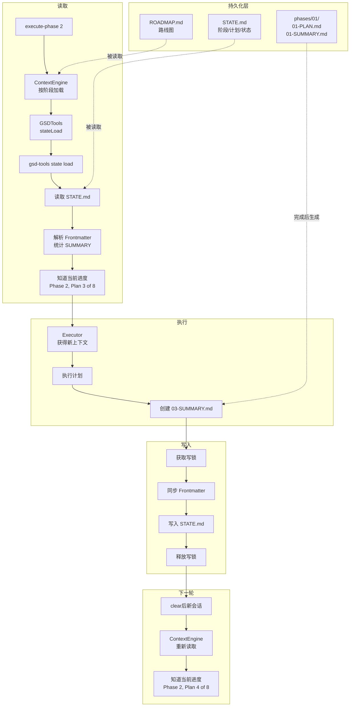
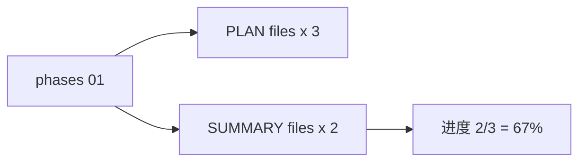
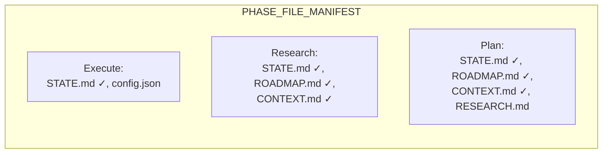
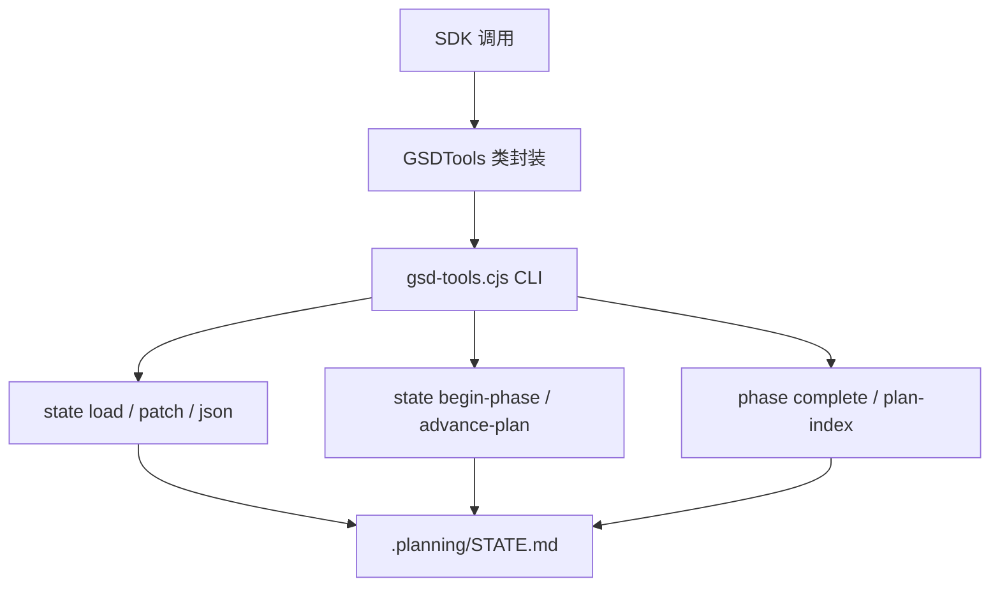
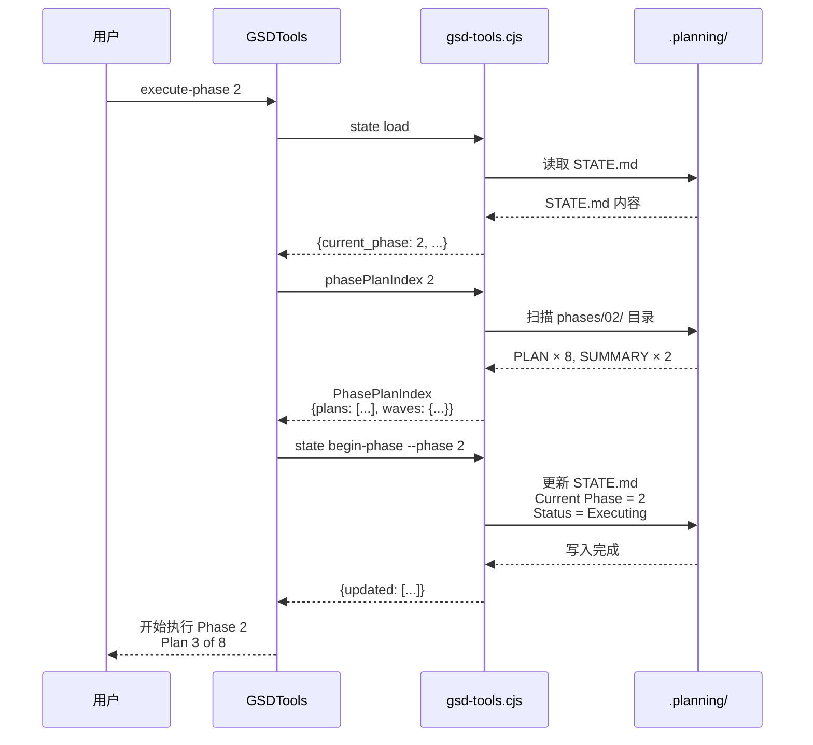
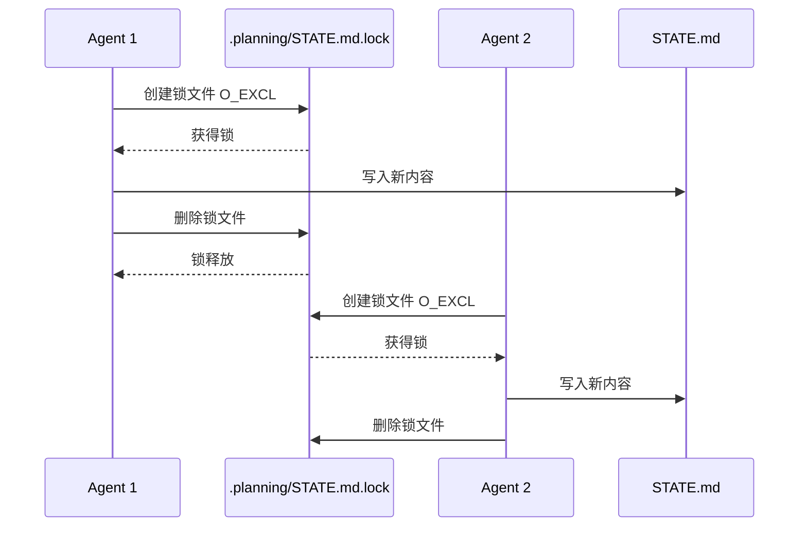
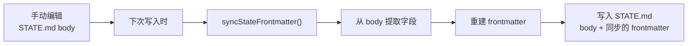
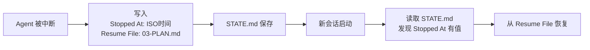

# GSD 进度追踪原理

## 核心问题

为什么 GSD 每次启动都能准确知道做到了哪一步，而普通的 AI 编程对话会"失忆"？

答案是：**GSD 不依赖记忆，只依赖文件**。

---

## 传统 AI 助手的困境

```
用户: 帮我做项目 X
AI:   好，开始做...
      [做了 100 步对话后]
      [上下文窗口满了]
      [AI 开始遗忘早期决策]
      [做出来的东西开始矛盾]
```

AI 会忘记的原因很简单：**状态存在内存里，关机就没了**。

---

## GSD 的解法：所有状态落盘

GSD 把所有进度信息都写入 `.planning/` 目录下的文件：

```
.planning/
├── STATE.md       # 当前状态（当前阶段、当前计划、进度百分比）
├── ROADMAP.md     # 路线图（所有阶段规划）
├── PROJECT.md     # 项目愿景
├── config.json    # 项目配置
└── phases/        # 各阶段的详细计划
    └── 01/
        ├── 01-PLAN.md
        ├── 01-SUMMARY.md    ← 完成后生成
        ├── 02-PLAN.md
        └── 02-SUMMARY.md
```

**关键点：这些文件在 `/clear` 后依然存在，在新会话里依然可以读取。**

## 整体流程全景图

下面这张图展示了 GSD 进度追踪的完整闭环：



**闭环说明：**

1. **读取**：用户输入命令 → ContextEngine 按需加载 → GSDTools 读取 STATE.md → 解析 Frontmatter → 知道当前进度
2. **执行**：Executor 获得全新上下文 → 执行计划 → 生成 SUMMARY 文件
3. **写入**：获取写锁 → 同步 Frontmatter → 写入 STATE.md → 释放写锁
4. **循环**：`clear` 后新会话启动 → 再次读取 STATE.md → 进度已更新

---

## 进度是如何计算的

**真正的进度就是 SUMMARY 文件的数量。**



每个计划完成后，执行器会生成一份 `*-SUMMARY.md`。所以 **SUMMARY 文件存在 = 计划已完成**，数一数就知道做了多少。

---

## 进度读取的核心机制

### 1. STATE.md 的双重结构

每份 `STATE.md` 都有两份数据：

**Body（人类可读）：**
```markdown
**Current Phase:** 2
**Current Plan:** 3 of 8
**Status:** Ready to execute
**Last Activity:** 2026-03-28

## Current Position
Phase: 2 (登录功能) — READY TO EXECUTE
Plan: 3 of 8
Status: Ready to execute
Last activity: 2026-03-28 -- 开始实现 JWT 验证
```

**YAML Frontmatter（机器可读）：**
```yaml
---
current_phase: 2
current_plan: 3
status: executing
last_activity: 2026-03-28
progress:
  total_phases: 4
  completed_phases: 1
  total_plans: 8
  completed_plans: 2
  percent: 25
---
```

Body 供人类阅读，Frontmatter 供机器解析，两者通过 `syncStateFrontmatter()` 自动保持同步。

### 2. ContextEngine：按需加载

ContextEngine 根据当前阶段决定加载哪些文件：



每个阶段只加载自己需要的文件，不多不少。Execute 阶段最轻量，只加载 `STATE.md`；Plan 阶段最重，加载所有相关文件。

### 3. gsd-tools：状态操作的唯一入口

所有状态读写都通过 `gsd-tools.cjs` 这个 CLI 工具：



---

## 完整读取流程

用户输入 `/gsd:execute-phase 2` 后，GSD 经历了以下步骤：



---

## 写锁：防止并发冲突

多个 Agent 并行执行时，写入 STATE.md 不会互相覆盖。`writeStateMd` 使用原子锁：



如果锁文件已存在（另一个 Agent 正在写），会等待最多 10 次（每次 200ms），超过则认为锁失效，直接写入。

---

## Frontmatter 自动同步

就算 Agent 手动修改了 STATE.md（比如改了个错别字），frontmatter 也会在下一次写入时自动同步回来：



---

## 断点恢复机制

如果中途停止，GSD 会把"停在哪里"写入 STATE.md：



---

## 总结

| 传统 AI 会话 | GSD |
|-------------|-----|
| 状态在内存里 | 状态在 `.planning/` 目录 |
| `/clear` 后全忘 | `/clear` 后照常读取 |
| 依赖对话历史 | 只依赖 STATE.md |
| 不知道做了多少 | **进度 = SUMMARY 文件数** |
| 并发写入会冲突 | 写锁保护，无竞态 |

**GSD 能"记住"进度的秘密很简单：它根本不记，它只读文件。**

每次需要知道当前状态时，就去读 `.planning/STATE.md`；每次完成一个计划，就写一个 `*-SUMMARY.md`。干净、可靠、不依赖任何内存状态。
