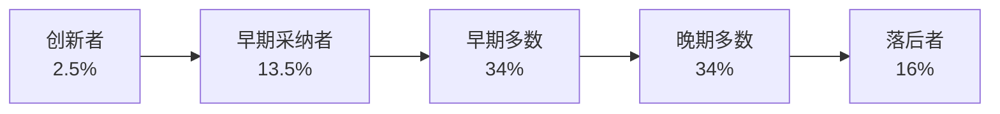
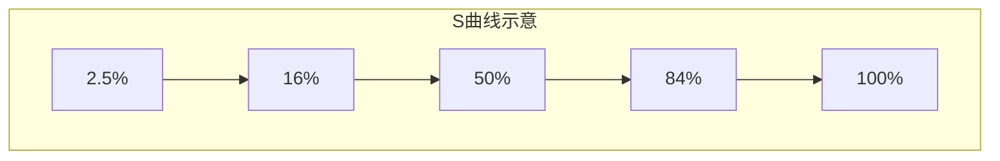

# 罗杰斯的创新扩散理论

## 核心概念

创新扩散理论（Diffusion of Innovations）由埃弗里特·罗杰斯（Everest Rogers）于 1962 年在《创新的扩散》一书中提出，研究的是**创新事物如何通过特定渠道在特定社会系统中传播**的过程。

简单来说：一个新事物（产品、技术、思想）是如何被越来越多的人接受的？为什么有些东西一夜爆红，有些却默默无闻？

## 创新扩散的五要素

罗杰斯认为创新扩散由四个基本要素和一个结果组成：

| 要素 | 说明 |
|------|------|
| **创新** | 被扩散的对象，必须具备相对优势 |
| **传播渠道** | 信息传递的媒介（人际、大众媒体等） |
| **时间** | 扩散过程的时间维度，包括采纳速度 |
| **社会系统** | 扩散发生的社会环境，包含规范、制度 |
| **采纳决策** | 结果：个体决定接受或拒绝创新 |

## 创新的五个特征

决定一个创新能否被快速采纳的关键，取决于目标受众的主观感知：

1. **相对优势（Relative Advantage）** — 相比现有方案，创新有多大改进？改进越明显，采纳越快
2. **兼容性（Compatibility）** — 与现有价值观、经验、需求的一致程度。兼容性越高，阻力越小
3. **复杂性（Complexity）** — 理解和使用的难度。越简单越容易被采纳
4. **可试性（Trialability）** — 能否在有限范围内先试用。可试性降低了采纳风险
5. **可观察性（Observability）** — 采纳效果是否容易被他人看到。越可见，越容易触发从众效应

## 创新采纳者的五个分类

这是该理论最广为人知的部分，按采纳时间将人群分为五类：

### 创新者（Innovators）— 2.5%

- 最早冒险尝试新事物的人
- 容忍不确定性和风险
- 往往有充足的资源和社交网络
- 对价格不敏感，更在意"新"

### 早期采纳者（Early Adopters）— 13.5%

- **意见领袖群体**，对扩散起关键作用
- 有眼光、有判断力，能在创新中看到价值
- 他们的背书会让早期多数放下顾虑
- 这群人是"跨越鸿沟"的关键

### 早期多数（Early Majority）— 34%

- 实用主义者，需要看到证据才行动
- 参考早期采纳者的使用反馈
- 要求创新有明确的使用价值
- 采纳前需要较长的决策周期

### 晚期多数（Late Majority）— 34%

- 保守派，等到大多数人都用了才跟进
- 主要动机是"怕被落下"
- 对创新有怀疑态度，需要完善的配套支持
- 价格敏感，等成本下降后才会采纳

### 落后者（Laggards）— 16%

- 最后采纳甚至拒绝采纳
- 高度传统，对变化持怀疑态度
- 参考过去的经验做决策
- 通常等到被逼无奈才改变

## 创新扩散的 S 曲线

采纳人数随时间呈现 **S 形曲线**（钟形分布）：

- **初期**：扩散缓慢，只有少数创新者和早期采纳者
- **转折点**：当早期多数开始采纳时，扩散加速（"引爆点"）
- **后期**：市场饱和，扩散速度放缓

## "跨越鸿沟"（Crossing the Chasm）

杰弗里·摩尔（Geoffrey Moore）在罗杰斯理论基础上提出，早期采纳者和早期多数之间存在一条**鸿沟**：

- 创新者和早期采纳者愿意为"新"买单，容忍不完美
- 早期多数要求"实用"和"稳定"，不接受风险
- 很多创新产品死于这道鸿沟——小众热捧，大众不买账

**跨越鸿沟的关键策略**：聚焦一个细分市场（Niche Market），集中资源打透一个垂直场景，用成功案例带动早期多数。

## 在金融投资中的应用

### 理解市场周期

- **早期阶段**：创新者进入，市场尚未关注（可能是好的买入时机）
- **加速阶段**：早期多数涌入，资产价格快速上涨（趋势投资者入场）
- **后期阶段**：晚期多数和落后者跟进，往往是泡沫阶段的信号

### 识别投资机会

- 关注创新者在关注什么（前沿技术、新商业模式）
- 等待早期采纳者的验证（产品能否跨越鸿沟）
- 在早期多数进场前布局，在晚期多数进场时考虑退出

### 风险提示

- 创新扩散失败（无法跨越鸿沟）的案例远多于成功案例
- 落后者拒绝采纳不代表创新没有价值，可能只是时机不对
- 不要把"大多数人都在做"当成正确的信号

## 批判性思考

- **不是所有创新都值得扩散** — 相对优势可能是主观的、暂时的
- **社会系统的影响被低估** — 制度、文化、基础设施决定了扩散的天花板
- **扩散速度不等于创新质量** — 病毒式传播的东西未必有价值
- **模型是理想化的** — 现实中各类群体之间没有明确界限

## 参考资料

- Rogers, E. M. (2003). *Diffusion of Innovations* (5th ed.). Free Press.
- Moore, G. A. (2014). *Crossing the Chasm* (3rd ed.). HarperBusiness.
